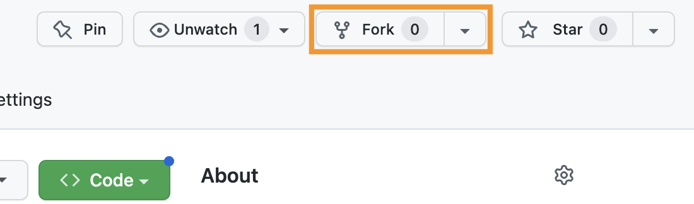
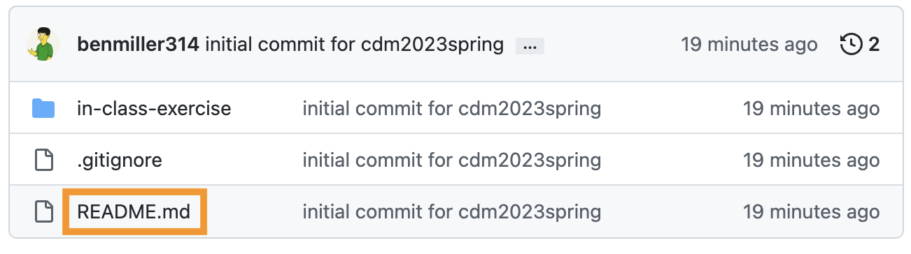
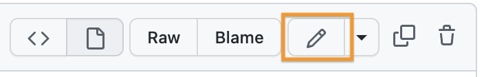
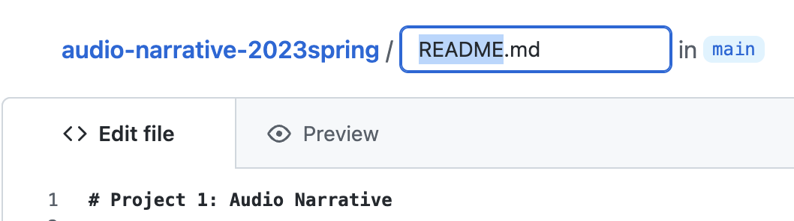
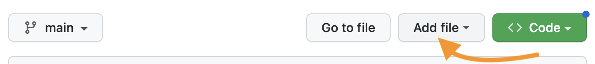

# Digital Affordances

**Texts to have "read":**

* Tyler Su's ["Playing Lev Manovich"](https://tylersu.github.io/o/)
* Sample sound narratives

**Writing to turn in:**

* A post to the main course [issue queue]({{site.github.issues_url}}/2), reflecting on what you noticed and wondered in your reading/playing/listening

## Plan for the day

<!-- 2023 UPDATES: 
* Swap the part of 2022's lesson 3 that deals with GitHub into lesson 4, and replace it with the part of lesson 4 that deals with the audio narratives.
-->

1. Sound, space, and attention
2. So what's digitality got to do with this?
3. Audio unit assignment
4. Fork and clone
5. Homework preview

I've set up a shared note-taking space: <a href="https://bit.ly/cdm{{site.course.slugterm}}-notes">bit.ly/cdm{{site.course.slugterm}}-notes</a>. Any volunteers to be in charge of notes for today? Usually 2-3 people works best...

PS. Advice from my years of experience doing simultaneous note-taking: it always helps to leave a blank line at the bottom for another note-taker to jump in. (Which also means, please add another blank line at the bottom when you do jump in!)

## 1. Sound, space, and attention

<!-- Have Tyller's and Jackie's pieces open from the beginning, so you can illustrate points by demoing what they've done (e.g. soloing or muting). -->

I was reviewing the posts on the forum as they relate specifically to the audio narratives. Lots of great observations there! Here are a few themes I wanted to highlight:

Audio engages by being immersive

A number of posts noted the way you felt you were <em>in</em> the coffeeshop, or the haunted house, or the apartment making dinner. Diego put it most dramatically: "When listening to 'Coffee Shop Conversations' I felt transported. If I closed my eyes I could imagine I were there."
 

A large part of this immersion, as Ben (Adams) usefully deconstructed it, is that we use our ears to orient ourselves in space: in "Come Over For Dinner," "we hear the fire alarm more predominantly in our right ear at first. After a few blares, the sound of the alarm eventually shifts equally to both ears, growing in volume, before the fire alarm stops making noise." When we hear a new sound more in one ear than the other, we're attuned to turn toward it, to balance it out.<a id="ftnref1" class="ftnref" href="ftn1" title="Later, I'll remind you from this same principle that two speakers are unlikely to be at 100% left or 100% right; even if you're walking between them, you'll probably turn at least partway toward them while they're talking. Try 60% and see how it goes.">[1]</a> (As we do so, other sounds may shift from balanced to peripheral.) In this sense, Ben notes, the piece "is in a first-person perspective; our ears are that of the main character's." This works best with headphones, of course, but even over speakers relative differences in volume can convey relative distance.
 <!-- Show -->

Continuous background conveys a consistent place/time

Lauren, writing about "Coffee Shop Conversations," pointed out that "the overlapped sounds of miscellaneous conversations, keyboard clicking of laptops, and jazz music playing" worked to quickly establish the setting.

Ariana took a similar point even further, also noting the realism of the opening soundscape – but then highlighting the way we leave the coffee shop for an imagined outer space when "that conversation was brought to the foreground, and the coffee shop noises were put into the background [...] the blurring out of all the other noises and echo effect made the listener feel the conversation in real time, like you were in space while hearing the conversation about space."

Relatedly, many podcasts and radio shows also use short musical interludes to smooth changes from one "act" or segment to another: the music provides continuity across the gap.
 <!-- Try turning off the music... then the chatter... then the ambient hum. -->

Contrasting sound draws attention

The opposite of the previous point is that abrupt changes in background can be used to create a sense of a scene change, or a jump forward in time. For one example, Kellen noted the way "the music entirely went away right before the characters started running in 'The King of the Jungle.' " Asher, similarly, noted the introduction of the squeaky door to convey movement from outside to inside the house in "A Haunted Halt."

But, more mundanely, incidental sounds like chopping, cash registers, or broken glass, give us a sense of time passing – of something happening. These "events" drew a lot of attention in your comments. And this makes sense: one definition of narrative is <em>interruption of a stable context</em>, and the fallout of that interruption. When sounds recur or extend, they create a stable context, yes – but one we can break. ;&nbsp;)

The flip side of this is that a long time <em>without</em> a change can drain attention: it's often harder to get away with very long clips than with very short ones. (And the same might be said of paragraphs, let's not forget!)

Emotional effects come from layering

Suchi pointed out the way the whole is crafted from overlapping parts: "As I listened I found myself picking layers of the audio, separating and isolating sounds like the pouring of coffee, chatter of people, question asked by a character, the background jazz music as they all happened at the same moment."

Ariana noted the emotional signals music can provide: "The consistent classical background music also seems fitting as one thinks about coffee and coffee shops as a calming space," despite the fact that "with how busy they get, they can create a chaotic environment."

Asher, likewise, noted the way horror genre elements &ndash; the "squeaky doors and echoing footsteps," along with the low-pitched hum and whispered dialogue &ndash; can do "an amazing job [...] to paint a scene," even when they're a little cliche. Listeners' familiarity with the genre can add its own depth when their expectations are fulfilled. ...And then we can thwart them. ;&nbsp;)

## 2. So what's digitality got to do with this?

Can I get five people to recap the five "principles of new media" from the webtext I asked you to read? i.e. One person, one term.

<!-- numerical representation, modularity, automation, variability,
and transcoding -->

And again, let's use <a href="https://bit.ly/cdm{{site.course.slugterm}}-notes">those notes</a>.

What does putting these concepts together with the sample narratives help you notice or better understand – about either the audio narratives or about the concepts themselves?

What do these framing concepts help you see about "digital" that wasn't part of the story you told in your group last class?

<!-- Notice the Credits page: the ethics around using sources don't go away when you go digital. Copying is easy, and doesn't do direct harm to the original artifact... but it could cause reputational damage or lost opportunity to the original author.

Did anyone click through the links on the Credits? The original piece with the subtitle "Playing Lev Manovich" is now defunct, because it relied on Flash. That's another feature (or bug?) of digital media: ephemerality. One reason to prefer standards-based tools, rather than proprietary formats. Similarly, Su's original bio linked here is now gone: she stopped using the service. Another reason to learn how to roll your own. -->

## 3. Return of the GitHub: the Audio Narrative assignment

As I explained in the syllabus, your first project is to **arrange layers of sound to convey a sense of place and story.** In assigning this, I have two main goals for you:

* to learn how to capture sound and edit it using digital tools, and
* to explore the affordances of sound as a medium, with particular attention to its ability to communicate
  - *immersive environment* and
  - *narrative pacing and change*.

Head over to <strong><a href="https://github.com/benmiller314/audio-narrative-{{site.course.slugterm}}">github.com/benmiller314/audio-narrative-{{site.course.slugterm}}</a></strong>, and <strong>fork</strong> the repo to take control of it.

<figure></figure>

### 3a. Let's read!

The README file has additional guidelines and constraints, which I hope are generative; deadlines to give a rhythm to your production, review, and revision; and some "parachute prompts" if you feel lacking in direction and a deadline's coming up.

<!--
Go through overview, constraints, deadlines. Explain about parachute prompts.
-->

### 3b. Then, let's practice that edit / commit cycle!

<ol>
  <li>In your own fork (check the URL), click on the README.md filename to get to the file's own page. <figure></figure></li>
  <li>Click on the pencil icon to edit. <figure></figure></li>
  <li>Change the name of the README.md file to <strong>assignment.md</strong>. <figure></figure></li>
  <li>Commit the change.</li>
</ol>

### 3c. And add one new feature: adding files.
<ol start="5">
<li>Create a new file in the repository, to be your new README.md. <figure></figure></li>
<li>Fill it with some placeholder content, like, "This is the future site of So-and-So's audio narrative." You can (and should!) update this later.</li>
<li>Commit this change, too, and you should have a new welcome screen at the start of your repository!</li>
</ol>

Next time, we'll clone and play around with the files in the "in-class exercise" directory.

<!-- NOTE FOR NEXT YEAR: I had a full 15 minutes left! I should have been able to do the generative writing exercise today! -->

## HW for next time:
* **Download** the [Audacity 3](https://www.audacityteam.org/download/) audio editor, or update to the latest version if you already have it.
   - NB: some source sites will try to trick you into downloading unrelated software. Don't fall for it. Start on the audacityteam.org page, and read the links carefully.
   - *Optionally* also download the [separate FFmpeg import/export library](https://manual.audacityteam.org/man/faq_installing_the_ffmpeg_import_export_library.html), which expands the file types Audacity can handle. Might be useful for imports from your phone, depending on your device!
   - *Optionally* download a phone recording app. Your device may already have a decent default voice recorder that you can use; let the class know if you have suggestions (or anti-suggestions). I've had success with Parrot in the past.
* **Watch** this recommended [Audacity 3 tutorial](https://www.youtube.com/watch?v=O1WzmigxZdM) (about 20 minutes long) and come in ready to play with the software (and ask any questions that come up)
* **Pack** headphones – we should have time to practice!
* Finally, **read** one chapter from the book _Writer/Designer_ (Ball, Sheppard, and Arola, eds), which is <a title="not posted to preserve the limited distribution that helps justify my fair use claim (as does my colorless copy and the limited amount copied, relative to the book)" href="{{site.canvas_url}}/external_tools/673?display=borderless">posted to the Perusall social annotation software on Canvas</a>. It's about sources, assets, and citation in the context of multimedia projects.
  - Perusall allows you to take notes in the margins that other people in the class can see. This is optional, but highly encouraged!
  - NB: My original schedule had this reading due over the weekend (i.e. as homework after lesson 04), but I worried the workload was imbalanced. If you've already planned out your work and can't read it by Thursday, that's okay; just catch up before you write your audio narrative proposal.

_Optional:_ This will be part of the homework for next week, but you'll also be writing a proposal over the weekend. If you have more time midweek, you may want to get a head start on this reading:

- I'll also ask you to read the following advice on sound recording, _listening to the embedded clips_:
  - Fowkes, Stuart. “The Top 5 Things You Need to Make a Great Field Recording.” *Cities & Memory: Field Recordings, Sound Map, Sound Art*, 13 Aug. 2014, [https://citiesandmemory.com/2014/08/top-5-things-need-make-great-field-recording/](https://citiesandmemory.com/2014/08/top-5-things-need-make-great-field-recording/).

  - MacAdam, Alison. “6 NPR Stories That Breathe Life into Neighborhood Scenes.” *NPR Training*, 30 Oct. 2015, [https://training.npr.org/audio/six-npr-stories-that-breathe-life-into-neighborhood-scenes/](https://training.npr.org/audio/six-npr-stories-that-breathe-life-into-neighborhood-scenes/). (**Note the time skips she recommends**: sometimes a long clip is embedded, but not meant to be listened to in full.)

<section class="footnotes">

<a id="ftn1" class="ftn" href="ftnref1">[1]</a> Later, I'll remind you from this same principle that two speakers are unlikely to be at 100% left or 100% right; even if you're walking between them, you'll probably turn at least partway toward them while they're talking. Try 60% and see how it goes.

</section>