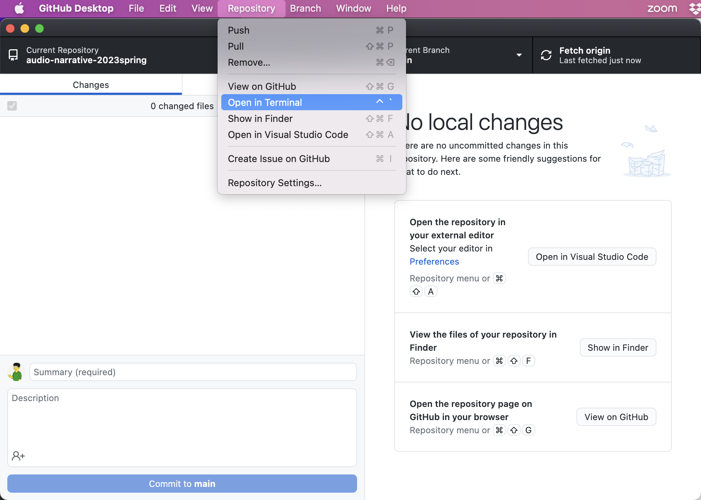
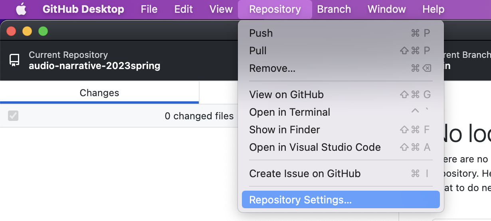
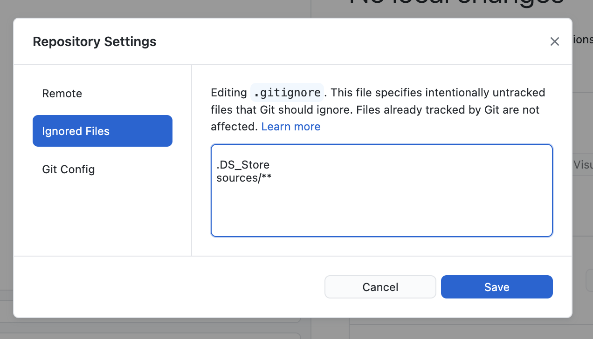

# Sources, Citation, Studio

**Texts to have read / listened to:** _Writer/Designer_ on ["Working with Multimodal Assets and Sources"]({{site.canvas_url}}/external_tools/673?display=borderless) (Ball, Sheppard, Arola); Stuart Fowkes on [field recording](https://citiesandmemory.com/2014/08/top-5-things-need-make-great-field-recording/); Alison MacAdam on [breathing life into audio scenes](https://training.npr.org/audio/six-npr-stories-that-breathe-life-into-neighborhood-scenes); and optionally some overviews of [CC licenses](https://wiki.creativecommons.org/wiki/Howitworks_Comic1) and [Fair Use](https://fairuse.stanford.edu/overview/fair-use).

**Work to have achieved:** a proposal for the audio narrative, posted to the [issue queue]({{site.github.issues_url}}/3)

## Plan for the day

1. Final Repo Configurations: dealing with large files and sources you shouldn't distribute (5-10 min)
2. Composing Advice, Questions and Answers
3. Key Concepts and Practical Takeaways from the Reading (10-20 min)
4. Homework: preview (5 min)
5. **Studio time** (40-50 min)

## 1. Final Repo Configurations: git-lfs and .gitignore

There are two features of your repository that we didn't yet set up, but which should save you headaches as you get into the thick of the project:

### 1a. Git Large File Storage

Large file storage, or LFS, is a way to avoid counting large project files against your free storage. Essentially, it moves files you designate onto a separate server, and replaces them with a unique pointer to that file.

The setup is pretty simple, but it does require access to the command line. 

* If you're on Windows, you'll want to download and run the [git for windows installer](https://gitforwindows.org/).

* If you're on a Mac, you'll want to download and run the [git lfs installer](https://git-lfs.com/).

Once you have the software, follow these steps to activate it:

<ol>
  <li>In either platform, open your repository in GitHub Desktop, then use the Repository menu to "Open in Terminal."
    <figure>
      
      <figcaption>You can find the "Open in Terminal" command under the Repository menu</figcaption>
    </figure>
  </li>

  <li>In the command line window that opens, type <code>git lfs install</code> and hit enter.</li>

  <li>Next, type <code>git lfs track "*.aup3"</code> and hit enter. (NB: You could also add other extensions, if you want, by swapping out the <code>aup3</code> and doing it again.)</li>
  
  <li>Head back to GitHub Desktop, where you should see a new file called <code>.gitattributes</code>. Commit the change to that file, and that's it! Now anything that matches the filetype you selected in step 3 will be tracked using LFS.</li>
</ol>

### 1b. Ignoring files or folders

An even easier process will protect you from accidentally oversharing source files. 

<ol>
  <li>In your repository, using Finder/Explorer, create a new folder and give it a name; for the sake of these instructions, I'll call it "sources".</li>

  <li>Now, in GitHub Desktop, I'm going to edit the Repository settings using the same menu as before.
    <figure></figure>
  </li>

  <li>In the dialog box that comes up, select "Ignored files," and then add a new line with the text <code>sources/**</code>.
    <figure></figure>
  </li>

  <li>When you click Save, you'll see a new file called ".gitignore" in your list of changes. Commit the change, and now Git will ignore every file in that sources directory.
  </li>
</ol>

EXT: If you finish that and you're waiting for the rest of us, read through the next section of Q&amp;As and pieces of advice.

## 2a. Composing advice, based on proposals

Lots of great ideas in those proposals. My small bits of broadly applicable advice:

This is My Life

  If you're doing a day-in-the-life or commute, the challenge is to make at least some of your sounds different from everyone else's: parts of a particular soundscape, not a generic one. Voiceover, even the little mutterings of a solitary person to themselves, may help; your choice of a soundtrack overlay might, as well.

Consider Getting it in Writing

  One benefit to drafting a project in prose is that your script doubles as a transcript – which improves both accessibility and discoverability. It also means you get clean version history as you revise your script. (One downside is that it's sometimes easier to <em>do</em> or <em>say</em> than it is to <em>write</em>.) Still: something to keep in the back of your mind, especially if you're working on something fictional.

Roll Tape

  On the flip side, if you're proposing something where you're not sure what you'll find, consider a journalistic approach: record more than you think you'll need; narrate what you're doing as you're doing it; then add a post-hoc voiceover that makes sense of (tells the story of) what you ultimately found.

Need to show time passing within a single setting? Try a crossfade

  If your proposal covers a long time – a full day, a full game, etc – you won't be able to represent it minute by minute. Instead, you'd normally want to jump from moment to moment with a sharp cut from one background track to another. But if you want to give a sense of time passing without changing where you are, one option is to fade out from the same background track back to itself, but later on, so there's still a sense of change within the sameness.

## 2b. FAQ / Q & A

And here are some great questions that came up in Perusall that I want to be sure to answer publicly:

<!-- permission vs copyright -->

I'm assuming that because repurposed assets are borrowed from other authors with their permission, they are not considered copyright?

    
Not exactly. Something being copyrighted does not automatically mean no one else can use it: it just means that <em>the author gets to decide</em> what permissions to grant. And in the US, as Ball et al note, "the moment an author 'fixes' an original idea into a text, he or she immediately has copyright over that text" – though they are permitted to transfer that right to others, e.g. to a publisher (154). 

    
In the case of a work that's Creative Commons licensed, for example, the work is also still protected under the copyright of its creator(s), who can decide to change the license later; and all CC licenses (except for CC0) require derived works to cite the original creator. (This is the BY clause.) On the other hand, even copyrighted works are subject to fair-use doctrine, so reuse can't be restricted entirely.

<!-- generative AI -->

Recently with the invention of neat AI systems like ChatGPT and Dall-E copyright has become a topic I'm more interested in. While ChatGPT and Dall-E generate text and image respectively, what happens when an AI generates music. Can someone copyright that as their own?

It's an open question, for now, and a tricky one! Part of the complication is how these AIs are trained: usually, by scraping and processing many thousands of previous creative works, including many that are under copyright. The question then becomes whether the resulting work is sufficiently transformative of the original art. If you do a targeted scrape of the collected works of Lin-Manuel Miranda and specifically ask the AI to produce music in the style of Lin-Manuel Miranda, that's probably too directly derivative. If you instead ask it to produce music in the style of Mozart, you might get something more new and strange &ndash; and therefore more defensible under fair use precedents. (Likewise, the more diverse the training set.)

Another part of the complication is the question of who counts as the "creator" of algorithmically generated works: the AI itself? the people who fed it training data? the people who wrote the algorithm? the people who passed the algorithm a prompt to generate from?

This is so new that it's only just starting to go through the courts, and it wouldn't be surprising for the courts to reach different conclusions that then have to be resolved higher up in the system. For those interested in reading more, think pieces abound. Here are a few I found just now: 
  <ul>
    <li>Brittain, Blake. 2023. “Computer Scientist Says AI ‘artist’ Deserves Its Own Copyrights.” Reuters, January 11, 2023, sec. Litigation. <a href="https://www.reuters.com/legal/litigation/computer-scientist-says-ai-artist-deserves-its-own-copyrights-2023-01-11">https://www.reuters.com/legal/litigation/computer-scientist-says-ai-artist-deserves-its-own-copyrights-2023-01-11</a>.</li>
    <li>Mathur, Atreya. 2022. “Art-Istic or Art-Ificial? Ownership and Copyright Concerns in AI-Generated Artwork.” <em>Center for Art Law</em>. November 21, 2022. <a href="https://itsartlaw.org/2022/11/21/artistic-or-artificial-ai/">https://itsartlaw.org/2022/11/21/artistic-or-artificial-ai/</a>.</li>
    <li>Vincent, James. 2022. “The Scary Truth about AI Copyright Is Nobody Knows What Will Happen Next.” <em>The Verge</em>. November 15, 2022. <a href="https://www.theverge.com/23444685/generative-ai-copyright-infringement-legal-fair-use-training-data">https://www.theverge.com/23444685/generative-ai-copyright-infringement-legal-fair-use-training-data.</a>
    </li>
  </ul>

<!-- credibility, ethos, and licensing -->

What does "credibility" mean in the context of our soundscape projects, which are narrative rather than scholarly?

  
It's less a matter of accuracy, in this case, than of appropriateness and ethos more broadly: Does your use of the asset take genre expectations into account? Have you cited where it came from and your license for using it (which could be that it's a fair use, or that you created it), so listeners know you're being ethical in your sourcing?

  
 Relatedly, if you're using CC-licensed material that includes an attribution (BY) clause, have you named your source <em>in the derived project itself</em>, i.e. in the audio? (Even if it's a "for full credits, go to this URL.") If you're using something with a sharealike (SA) clause, have you applied <em>the same license</em> to your own work? Do you have any <em>incompatible</em> SA licenses? Have any identifiable voices given their consent to being recorded, and have you documented that consent somewhere?
 
  
All of those actions help determine whether you seem trustworthy in your use of source material. 

<!-- 

Do we need to request permission from a copyright owner for sounds, such as crowd noises, we may find on the internet for our project?

It depends on how you're using it, and what permissions the creator may already have granted. There's a lot of multimodal source material that's released either into the public domain (in which case you don't even <em>need</em> to cite it... though I suggest you do, for ethos reasons) or released with explicit permission to copy (e.g. with a Creative Commons license). In those cases, you don't need to ask for permission because you already have it.

You may also be able to make the case that your use of the source material counts as a Fair Use. Consider the Four Factors (Ball et al 156): the <em>purpose</em> of your use, the <em>nature</em> of the copyrighted work, the <em>amount</em> of the work used, and the <em>market effect</em>. If the preponderance of those factors point to your use being fair, you can probably get away without consulting the original writer/designers.

Where copyright and explicit requests for permission come into play is when your use does *not* qualify as Fair Use: for instance, if you're releasing something widely that just reuses the full chorus of a famous song and could ostensibly substitute for paid downloads of an original song, you're on the wrong end of nature (creative work), amount (heart of the work), and market effect.

It's legitimately complicated! Feel free to talk it out with me if you're not sure about the Fair Use analysis.

-->

<!--

Do we have to obtain a CC license? 

Not necessarily! You get to decide, based on whether you want others to be able to reuse and remix your work without asking you, or if you'd rather they got in touch so you could decide to offer or withhold permission. Remember that if you do nothing, your work is automatically under your own copyright!

And even if you do want to be permissive by default, you'd usually still have the freedom to decide what level of permission to give: e.g. whether it could be used for commercial purposes or not, if your work had to be left intact to be used or if it could be modified, etc. There's a free tool at <a href="https://creativecommons.org/choose/">creativecommons.org/choose/</a> to help you weigh those licenses... and there are other open licenses, besides CC.

The one exception, when you don't get a say in what license to use (or whether to provide any license), is if you're using material that has a ShareAlike clause: that is, if one of your assets is <a href="https://creativecommons.org/licenses/by-sa/4.0/">CC-BY-SA</a> or <a href="https://creativecommons.org/licenses/by-nc-sa/4.0/">CC-BY-NC-SA</a>. In that case, you <strong>must</strong> use the same license as your source. <em>Note that this means you cannot simultaneously use sources with incompatible ShareAlike licenses.</em>

-->

<!--

Who exactly are asset lists for?

This came in late enough that I don't have a full write-up. What do you all think?

-->

<!-- GH as storage-->

How does GitHub stack up to actual cloud storage services? Should we be mindful of how many commits of larger (non-text) files we make?

This came in late enough that I don't have a full write-up, but two short answers: (1) this is why we need <a href="https://git-lfs.github.com/">git-lfs</a>, which I've already set up on the soundscape repository; (2) this is one reason to keep your full sources in a folder that you <a href="https://docs.github.com/en/get-started/getting-started-with-git/ignoring-files">.gitignore</a>

<!-- screencasts! -->

Screencast of submission process

<figure>
<figcaption>Submitting a project preview: Save, Export, Commit, Push</figcaption>
<iframe src="https://pitt.hosted.panopto.com/Panopto/Pages/Embed.aspx?id=eb1ab95d-5f91-4081-8602-ae2a0115f1db&autoplay=false&offerviewer=true&showtitle=true&showbrand=false&captions=false&interactivity=all" height="405" width="720" style="border: 1px solid #464646;" allowfullscreen allow="autoplay"></iframe>
</figure>

Has anyone tried out any of the sites linked to from our plentiful <a href="{{site.github_url}}/resources">Resources</a> page? Any recommendations, warnings, or other advice for your classmates?

Note that there are sections for both free/licensed sounds and music, and also (separately) for audio-unit-specific advice and examples.

## 3. Key Concepts and Practical Takeaways (10-20 min)

In a minute, I'll ask you to group up and work through the questions below about the reading/listening from the last week, taking notes in the shared google doc ([bit.ly/cdm2023spring-notes](https://bit.ly/cdm2023spring-notes#heading=h.7q6z70363fse)). Some questions you should be able to zip through quickly; others may require more discussion. (Heads up: even several of the True/False questions are more complicated than that binary implies! ;)

Let's see what happens if we run with the groups from lesson 2, subject to roster changes since then:

* Asher, Jackson, Lauren, Suchi
* Diego, Janna, Jordan, Kellen
* Mike, Ana, Betul, Christopher
* Josie, Alex, Ariana, Michael
* Ben A, Elio, Skylar, Taylor

<!--

Please take notes in our <a href="http://bit.ly/cdm2023spring-notes">shared note doc</a> to make up for my inability to hear all the rooms at once. I'll float around as best I can, but I do love finding overlaps and tensions across groups, when possible!

Call me in () if you can't come to a resolution!
-->

### 3a. Using Sources

1. True or false: if you can find it on the internet, you can use it in your project.
2. True or false: the only sources you can use in this project are those you record yourself.
3. True or false: if you record your own sources, you don't have to cite them.
4. True or false: if you use a source with a Creative Commons license, you don't have to cite it.
5. What's the difference between fair use and Creative Commons?
6. How would you define a "credible citation" in relation to the audio narratives you've proposed?
7. Why do you think Ball, Sheppard, and Arola are so insistent about folder structure and file naming conventions?

### 3b. Recording Audio

8. What's one way to make sure you're recording the sound you want to (and not, say, the loud bus passing by your conversation)? <!-- headphones -->
9. What do Fowkes and MacAdam consider tempting cliches of soundwriting, and how do they suggest getting past them?  <!-- birds chirping, cars rolling by (which also sounds like water), kids at a playground. Get past with strong voiceover writing; contextualizing structure; specific instances of a theme. -->
10. Would you (each of you, specifically, for this project) want to work from a written script? Why or why not?
11. Would you (again, each of you in <!--the breakout room--> your group, today) want to incorporate human voices in your audio narratives? How or how much, and why (or why not)?

### EXT: Bonus questions for the swift

* Does my assignment of the _Writer/Designer_ chapter fulfill the criteria of fair use? Consider all four major factors.

* For each known asset in your project, add Rights information as per the "Touchpoint" on _Writer/Designer_ page 160. (You'll need to keep updating this, of course, especially as you determine what repurposed assets you really want to use.)

* EXT: Read through the link at the top of Fowkes' piece: [Top 10 Simple Field Recording Tips](https://citiesandmemory.com/2014/03/ten-top-simple-field-recording-tips/). Any surprises that others in the class should know about?

As time allows, Let's talk through any <strong>questions or tensions</strong> that came up. I especially want to make sure we're all on the same page about those fuzzier "True/False" questions.

<h2 id="hw-preview">4. Homework preview (5 min)</h2>
<a href="#hw">Jump down</a>

## 5. Studio time! (40-45 min)

<strong>Do whatever work you need to get <em>something</em> toward your project posted to your GitHub repository by Thursday:</strong> find audio sources you have permission to use, extract assets from them, record test voiceover with your phone or computer, start moving things around in Audacity, practice some more with GitHub Desktop (or command line git).

Warning: <strong>don't use the GitHub <em>website</em> for Audacity files!</strong> They quickly get too large for the site to handle. Instead, commit locally, then push, from GH Desktop (or the command line). Using Git-LFS should bypass that concern... but the website interface doesn't know how to do that!

The goal for now is to get a feel for how you work with audio, not to have a finished product. On Thursday, we'll use your experience to refine our shared baseline criteria and brainstorm some aspirational goals.

To help with goal-setting and reflection (and, again, so I can figure out where I can be most helpful), please <strong>write a brief note in the <a href="http://bit.ly/cdm{{site.course.slugterm}}-notes">shared doc</a> about what you're planning to work on today</strong>; at the end of class, reply to your own note to say what you achieved and/or to set yourself a new goal for homework.

**Call me in if you need help** with Audacity, Git/GitHub, or determining the license on an audio source!

<h2 id="hw">Homework for next time:</h2>

<ul>
<li>Look over the audio resources on the site, and dig into anything that seems like it would help you.<ul>
  <li><a href="{{site.github_url}}/resources#free-and-licensed-images-sounds-and-other-assets">Free and licensed sounds</a></li>
  <li><a href="{{site.github_url}}/#resources#advice-and-examples">Advice and examples</a></li></ul>
</li>
<li><strong>Work</strong> on your audio narratives, getting at least two sound assets in Audacity in conversation with each other. If you have time, do more!</li>
<li><strong>Push a preview</strong> of your project to your GitHub repository. As per the <a href="{{site.github.owner_url}}/soundscape{{site.course.slugterm}}">assignment prompt</a>, this should include:
  <ul>
  <li> A layered <strong>Audacity project file (.aup3)</strong>, showing the arrangement of your sounds so far (need not be a complete soundscape or narrative yet).</li>
  <li> At least one static <strong><a href="https://www.take-a-screenshot.org/">screenshot</a></strong> (.png or .jpg) of your Audacity file in progress. (You'll use this in your final reflection, for comparison later to subsequent drafts). Note that link: you shouldn't need your camera for this!</li>
  <li> A plain text (.txt) or markdown (.md) file, explaining in at least 300 words <strong>what you're showing us</strong> in this preview. Feel free also to ask questions or lay out next steps for yourself!</li>
  <li> An <strong>updated list of assets</strong> (either directly in README.md or in a separate assets.md / credits.md file), indicating which the files you've actually recorded or otherwise obtained. Add source documentation for any outside sources – along with your permission to use them (e.g. licenses, fair use; see <em>Writer/Designer</em> p. 160-165). Remember: thanks to version control, you don't need to rename this file. :¬)</li>
  <li>Finally, <strong>export a playable mp3 file</strong>, both as a snapshot and just in case something goes awry with your Audacity project file.</li>
  </ul>
</li>
</ul>
<a href="#hw-preview">Jump back to studio instructions</a>
