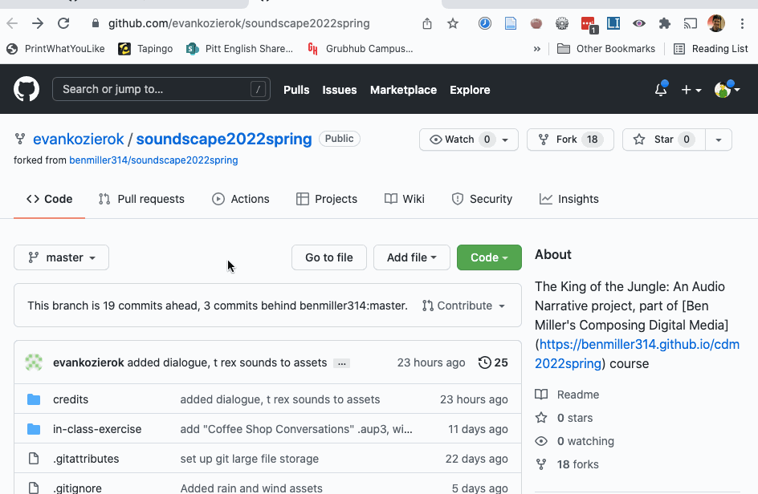
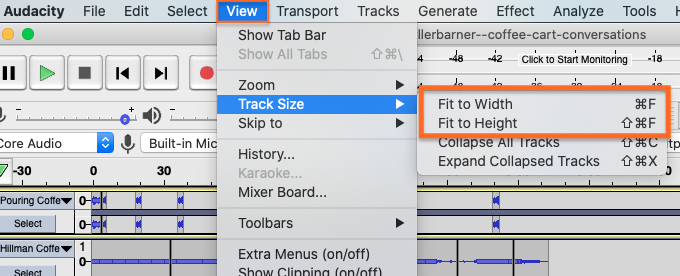
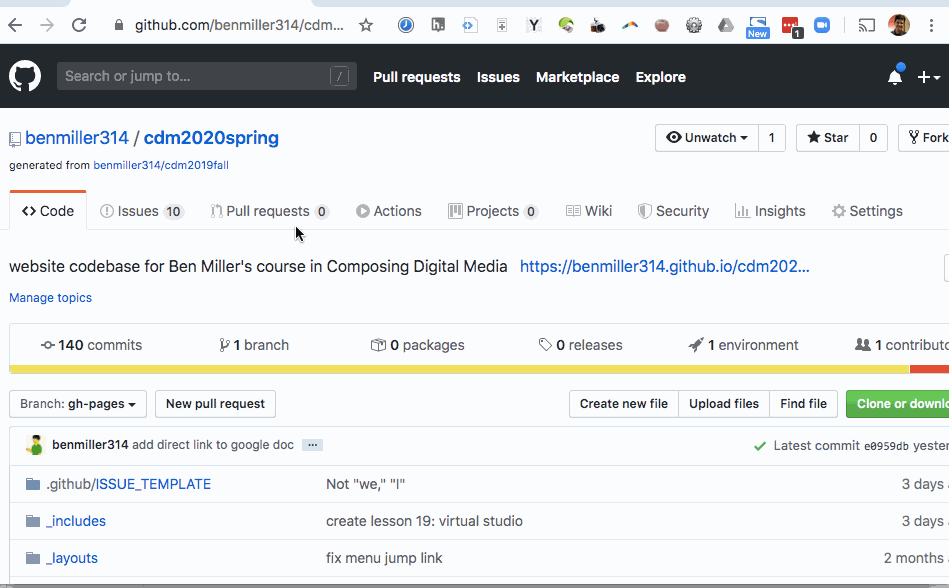

# Sound Unit Workshop

**Work to have done**: a solid attempt at a complete audio narrative, ideally meeting <a href="https://bit.ly/cdm{{site.course.slugterm}}-notes">baseline criteria</a>. Rough edges are still welcome.

**Plan for the day**:

1. Describe -> Evaluate -> Suggest: A Workshop Workflow (5 min)
2. Evaluation reminder: our shared criteria (5 min)
3. Peer review workshop (3 times 10-12 min); EXT: Studio
4. Evaluation revisited (10 min)
5. HW preview

## 0. Warm-ups and prep

NB: It's a workshop day! If you have more than one Audacity project file in your repo, to make this process easier, you should probably indicate in your README.md file where to find the main .aup3 file for your project. Take a minute to do that now, if you need to.

In your own space, think about writing you've had reviewed before, whether by peers or by teachers. What were the best, most helpful responses? What were the worst, least helpful responses? 

Based on that, **what could you do to make responses that _you_ give less like the worst, and more like the best?** Jot down some notes and reminders for yourself.

<!-- A lot of peer review fails because it falls to one of two extremes: noncommittal nods, or non-stop nitpicking. Neither really takes advantage of the output we have in front of us. Describe/Evaluate/Suggest helps avoid some of the potential pitfalls of peer review. -->

## 1. Describe -> Evaluate -> Suggest: A Workshop Workflow (5 min)

Today is all about getting _feedback_ for your projects. What does that metaphor mean? It's a process by which the output is picked up again as input. That means your job as a peer reviewer is to _return their outputs to them_, with a little added distance: to help them see what's coming across, so they can compare it to what they'd intended. <!-- A lot of times as writers, including as soundwriters, we don't even know if our audience is getting the main point we want to get across. This is a way of finding out. -->

To make that work, I'm going to insist that you provide this feedback in three steps:

<ol><li> First, <strong>describe</strong> what you hear, <em>without judging whether it's good or not</em>. What is this project? What do you think is happening? What stands out? What seems to be the focus? </li>
<li>Next, <strong>evaluate</strong> according to our shared criteria, in light of the focus you perceive in the project. NB: This is still a form of description.<!-- It's not about "good" or "bad" in the abstract but about where it meets or misses the shared or stated goals. --></li>
<li>Finally, <strong>suggest</strong> some revision possibility that you think might help take the project to the next level: we know these are drafts, so assume a revision is on the way. Given the goals, the focus, the criteria, what might be next? <!-- Pose your comments as a suggestion, not a command: and interpret comments you receive as suggestions, not commands. --></li>
</ol>

## 3. Peer Review Workshop (3-5 min setup, plus 10-12 min for each of 3 partners)

You're going to **download three audio narratives, as specified below,** and write your feedback for the authors _on GitHub_.

### Detailed instructions for workshop

1. Go to your first partner's repo on GitHub. If you had a fast connection and lots of disk space, you could clone (e.g. with the "Open with GitHub Desktop" option under "Code"); however, since we're all trying to do this at once, I think it makes the most sense to **download just the aup3 file.** (It'll be plenty big enough!) \
 \
NB: I think it might be best to **download and listen to one project at a time** – after that first one, we'll likely stagger, and so use less of our available bandwidth at the same time.

2. To do so, find the file and _click on its filename_ (that is, not on the commit message, but the .aup3 itself). You should get a new screen that says "Stored with Git LFS" and a Download button. (If you don't see that button, try the three-dots menu.) If given the option, save the file _anywhere that **isn't** your own repository_. You may want to give it a name that distinguishes it from other partner's files. <figure role="figure"> <figcaption>To download a single file from GitHub, click on that file's name. <em>GIF made with <a href="https://www.cockos.com/licecap/">LICEcap</a></em>. </figcaption></figure> Be patient: this might take a little while. When it's ready, open the file in Audacity. And if you can't find the file, ask the creator! 

3. Optionally, zoom out to see the whole Audacity project with View > Track Size > Fit to Height / Fit to Width.  <figure role="figure"></figure> Note that you can later use the same menu to Expand All Tracks; this will let you see the settings for pan, gain, etc.

4. Here's where the cycle really starts:
  * **describe** the soundscape and narrative you hear
  * **evaluate** the project relative to the shared set of criteria, and
  * **suggest** changes that you think would take it to baseline and/or above.

5. Finally, make sure you **post** all these comments – in language you'd be comfortable sharing publicly – on the latest commit on the project's GitHub website. \
 \
NB: In years past, I asked everyone to fit comments on index cards; that should give you a sense of how much writing I'm expecting here. (ie, it should be relatively focused.) But it's a little more environmentally friendly to write digitally instead. \
 \
Here's how and where to leave comments on GitHub: 
  <ol class="lalpha">
        <li>From the top right of the repository, under the green "Code" button, you should see a clock icon with a total number of commits.</li>
        <li>Clicking the clock or the number will give you the whole project history. For now, click any of the links just to the left, which will take you to the most recent commit.</li>
        <li>Scroll to the bottom of the _diff view_ that appears. You'll see a comment box there. Add your describe/evaluate/suggest comments there: 
            <figure role="figure">
                 
                <figcaption>You can leave comments on a particular commit using the GitHub website. <em>GIF made with <a href="https://www.cockos.com/licecap/">LICEcap</a></em>. 
                </figcaption>
            </figure>
        </li>
    </ol>

6. Repeat the steps above for your next two partners' repos. On subsequent loops, note that **after** viewing/listening to the project first, you may also want to read and/or refer to the previous comments.

### Your Groups

Let's do this!

Within each group, **you're responsible for commenting on the three (3) people that follow you in your line**; if that takes you to the end of the line, wrap around again.

Groups:

* <a href='https://github.com/Asher-Goods/new-audio-narrative-2023spring'>Asher</a>, <a href='https://github.com/juradodiego/audio-narrative-2023spring'>Diego</a>, <a href='https://github.com/MikeBailey412/audio-narrative-2023spring'>Mike</a>, <a href='https://github.com/josieharris1/audio-narrative-2023spring'>Josie</a>, <a href='https://github.com/BenA03/audio-narrative-2023spring'>Ben A</a>
* <a href='https://github.com/altrnate/audio-narrative-2023spring'>Jackson</a>, <a href='https://github.com/jannawohl/audio-narrative-2023spring'>Janna</a>, <a href='https://github.com/bst20/audio-narrative-2023springbst'>Betul</a>, <a href='https://github.com/lks50/audio-narrative-2023spring'>Michael</a>, <a href='https://github.com/skygel/audio-narrative-2023spring'>Skylar</a>
* <a href='https://github.com/lks50/audio-narrative-2023spring'>Lauren</a>, <a href='https://github.com/jordanmarch/audio-narrative-2023spring'>Jordan</a>, <a href='https://github.com/anayoungblut/audio-narrative-2023spring'>Ana</a>, <a href='https://github.com/arianakeith/audio-narrative-2023spring'>Ariana</a>, <a href='https://github.com/taylorjenkins/audio-narrative-2023spring'>Taylor</a>
* <a href='https://github.com/suchiattota/audio-narrative-2023spring'>Suchi</a>, <a href='https://github.com/kellenapp/audio-narrative-2023spring'>Kellen</a>, <a href='https://github.com/ChrisTroina/audio-narrative-2023spring'>Christopher</a>, <a href='https://github.com/alcalaaha/audio-narrative-2023spring'>Alex</a>, <a href='https://github.com/eliotann99/audio-narrative-2023spring'>Elio</a>

_(e.g. Asher will reflect back audio narratives for Diego, Mike, and Josie; Diego will reflect back for Mike, Josie, and Ben; but Mike will reflect back for Josie, Ben, and Asher; and so on.)_

If you're absent from class but not too sick to participate asynchronously, please try to complete your review <strong>before class time on Thursday</strong> – or earlier, if possible – so your partners can work with your feedback in mind. <strong>If that's just not possible (and I understand how that might be the case), let me know asap</strong> and I'll make sure your partners get feedback from me in the meantime. <!-- Saturday morning would be the latest when it might still be helpful, so that's the official async deadline; just confirm that you've pulled the latest version whenever you start. -->

## EXT: Studio
If any time remains, go ahead and get started on those revisions! If you have a chance to let me know in the [shared notes doc](https://bit.ly/cdm{{site.course.slugterm}}-notes) what you're working on or what you're wondering, all the better. :¬)

## 3. Evaluation reminder: our criteria (5 min)
We set up [a few shared goals and constraints](https://bit.ly/cdm{{site.course.slugterm}}-notes#heading=h.a7m7rjwmokeg) that meet the baseline requirements. Let's try to help everyone get at least to there!

<a title="as of Thu 2023-01-26">Baseline Requirements</a>

For a minimum grade of B, all projects for this unit <em>must</em>...

<ul>
  <li>Play for ~2-4 minutes, which need not include time for credits</li>
  <li>Have something happen or change during the piece (e.g. a shift in location, an event)</li>
  <li>Contain at least one sound originally recorded by you</li>
  <li> Contain at least one sound not recorded by you, but which you have permission (e.g. Creative Commons license, fair use, etc) to use</li>
  <li>List and credit file sources used, including your means of establishing permission</li>
  <li>Have three layers (tracks) of sound overlapping at least once in the file</li>
  <li>Meet deadlines and requirements from the chart on the assignment page (see: citation, reflection, project title in README)</li>
  <li>Export a playable ("rendered") .mp3 file</li> 
</ul>

<a title="as of Thu 2023-01-26">Aspirational Inspirations</a>

To target (but not guarantee) a grade above a B, the best projects for this unit <em>may</em>...
<ul>
  <li>Use Audacity effects that are new to you</li>
  <li>Write clear commit messages that signal your process and progress</li>
  <li>Use relative volume and other effects to signal distance</li>
  <li>Use left/right pan and low/high pass filters to create a sense of (locations in) space</li>
  <li>Have a clear organizational scheme you can articulate<ul><li> e.g. Transition seamlessly from clip to clip</li><li>e.g. Use sharp cuts to signal scene changes</li>
  <li>Have an emotional or intellectual intention that you can articulate</li></ul></li>
  <li>Show evidence (e.g. from workshop feedback) that audience interpretation matches what you intended</li>
  <li>Have a plot established so that the sequence of events someone is hearing can be visualized</li>
  <li>Include synthesized sounds created by an automated process</li>
  <li>Have over three layers of sound overlapping at least once in the file without it feeling like too much is going on (maintaining volume at a certain level)</li>
  <li>Normalize volume so that unimportant tracks don’t drown out others</li>
  <li>Involve more than one speaker</li>
  <li>Avoid dialogue that explicitly states where characters are or what they are doing</li>
  <li>Break expectations from what the character might actually be hearing (e.g. fade out background for emphasis; show a mental soundscape instead of a literal one)</li>
  <li>Provide a sense of closure or intentional ending (e.g. a narrative climax, a musical resolution, etc)</li>
  <!-- lots of good stuff in old-plans/2021spring/lesson-07! Maybe go back there for starter stuff next time! -->
</ul>

Any surprises there, before we move on?

## 4. Evaluation revisited (10 min)
Based on your viewing, if you'd like to propose changes to the baseline criteria, or add new aspirational goals for others to consider, please comment on the [google doc](https://bit.ly/cdm{{site.course.slugterm}}-notes#heading=h.a7m7rjwmokeg)!

# Homework for Next Time
* If you didn't finish downloading, listening to, and providing describe/evaluate/suggest feedback to all three of your partners, please try to complete your review <strong>before class time on Thursday</strong> – or earlier, if possible – so your partners can work with your feedback in mind. <strong>If that's just not possible (and I understand how that might be the case), let me know asap</strong> and I'll make sure your partners get feedback from me in the meantime.
* **Next class will be a soundwriters' studio**: a chance to implement your plans in light of the feedback from workshop.
  - A final-for-now draft is due at the end of Sunday, to give you time to write a reflection by class-time on Tuesday; see the [audio narrative prompt](https://github.com/benmiller314/audio-narrative-{{site.course.slugterm}}) for further details.
* Even as we zoom in toward the unit finale, I want to keep one eye open toward the bigger picture. Think about projects you'd like to try for at the end of term: e.g. What further possibilities of sound might you want to explore, perhaps in connection with other people, or with other media?
  - You can post these musings to the [Issue Queue]({{site.github.issues_url}}); there is no minimum length requirement.
