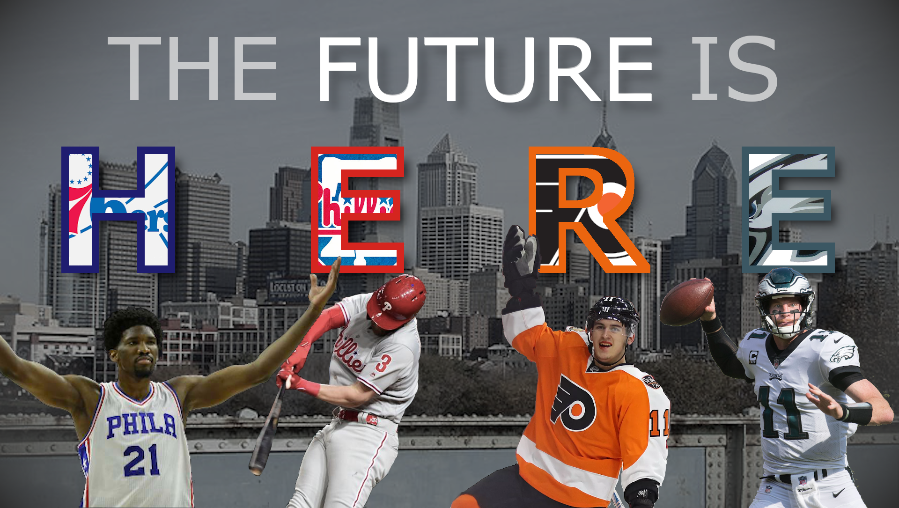

# Can You Picture It? Visual Rhetorics and Argument

**Work to have achieved**:

* A final-for-now version of your soundscape narratives, pushed to your own GitHub repo
* Write and [post]({{site.github.issues_url}}) reflection on same

**Plan for the day**:

1. Sound and Image <!-- (15-20 min) -->
2. Prominent affordances: GIMP (GNU image manipulation program)
3. Visual unit overview and assignment
4. Examples
5. EXT: Start HW
<!-- Have GIMP running in the BG -->

## 1. Sound and Image (5-10 min)

First, congratulations on finishing your first project for the class! Take a deep breath!

Second, I know you just finished writing up a reflection on what you did, but I'm going to ask you to write a little more.

* Put aside the details of your project for a moment, and think about what you've learned about **_sound as a composing medium_. What does it make possible? What does it make easy? What does it make difficult?** Take a minute to gather your thoughts on the page – in your own writing space, but save this somewhere you can find again at the end of the semester.

* Now think about Audacity, in particular, as a tool for soundwriting – or, if you used Audition, substitute that instead. Given the possibilities and affordances of sound, how does the software (try to) make hard things easier? How does the software tell you what's possible? And what tricks to navigating the software, if any, did you realize only after using it for a while? Was there anything you came to rely on, or use more often than you might have expected at first?

### Let's discuss (5-10 min)
And let's also take some notes in the [shared notes doc](http://bit.ly/cdm{{site.course.slugterm}}-notes). Can I get a few volunteers to be note-takers?
<!-- discuss the visual layout of Audacity, e.g. the layers; the feedback of cursor events and changing size/position; the menus -->

<!-- 

ALT: If you're participating asynchronously, please add comments to the notes in the doc. (Actually use the "add comment" feature, please, so I get an alert.) These can be questions, answers to questions, links to images or blog posts, or simply upvotes to express agreement.

 -->

## 2. Brief, brief intro to GIMP
For the next unit, you'll be working on directing attention through visual means, and the software I'm asking you to use is [GIMP](https://www.gimp.org/downloads/): the GNU Image Manipulation Program.

<figure role="figure">

<figcaption>Header image from GIMP website. Click to visit www.gimp.org.</figcaption>
</figure>

I want to do just a quick preview today, while we're thinking about the shape of tools – and then we'll focus on what I'm asking you to do with them.

Here's a project from a previous semester:
<figure role="figure">

<figcaption>"The Future of Sports." <a href="https://github.com/ktdemay/visual-argument-2020spring">Kevin DeMaioribus</a>, 2020.</figcaption>

Though unnamed in the image, the athletes/teams are, from left to right, Joel Embiid of the Philadephia 76ers (basketball), his arms raised to either side; Bryce Harper of the Philadelphia Phillies (baseball), with a bat in mid-swing; Travis Konecny of the Philadelphia Flyers (hockey), one hand waving; and Carson Wentz of the Philadelphia Eagles (football), preparing to throw.

</figure>

Onscreen, it's a flat image. But if we open it in GIMP...

### Initial questions to ask, as usual:

1. How is the space laid out?
  * What can you see? What can't you see that you expected to, if anything?
2. What's given the most prominent visual focus? Secondary focus?
3. What features/tools do you have quick access to?
  * For instance, what's featured in the menu? What about the context menus (e.g. when you right-click)?
  * Do any of those menus let you find what you were missing?

<!-- Note that these are the exact same questions I asked of Audacity. -->
<!-- give tour: layers at bottom right, tools at upper left, tool options at lower left, undo at top right. -->
<!-- Toggle visibility. -->
<!-- Duplicate -->
<!-- Warning about raster graphics: can scale down, but not up -->

There are lots of tutorials out there, including right on the GIMP website. If you ever get stuck, try their aptly named <a href="https://docs.gimp.org/2.10/en/gimp-getting-unstuck.html">Chapter 4: Getting Unstuck</a>. (I've also put some other resources on the <a href="{{site.github.url}}/resources">resources page</a>, and please feel free to suggest others as you find them!)

Among those: For next week, I'm planning to assign some videos on LinkedIn Learning. If you have trouble accessing them (folks sometimes do, and I haven't identified a pattern as to why), you may want to schedule an office hour visit and we'll try to get you sorted!

## 3. Visual unit overview and assignment

Your second project is to **make a rhetorical claim through the juxtaposition of images and text.** It's kind of a collage, but a collage with an _argument_ to make, an intervention in the world. In assigning this, I have two main goals for you:

1. to learn how to capture images and arrange them using digital tools, and
2. to explore the affordances of still images as a medium, and especially their ability to _direct attention_ and _help make ideas memorable_.

To read the full assignment – and make a copy for yourself – go to <strong><a href="https://github.com/benmiller314/visual-argument-{{site.course.slugterm}}#project-2-visual-argument--rhetorical-collage">github.com/benmiller314/visual-argument-{{site.course.slugterm}}</a></strong>.

Let's read through this together.

<!-- Go through overview, constraints, deadlines. -->

## 4. Examples

Here are some more student examples in response to this actual assignment:
* [Human Trafficking](https://github.com/csk32/visual-argument-2020fall/blob/master/Human_Trafficking_updated.png), by Christianna Kelley
<!-- * [The Future of Sports](https://raw.githubusercontent.com/ktdemay/visual-argument-2020spring/master/pngs/future.png), by Kevin DeMaioribus -->
* [Let's Talk About It](https://raw.githubusercontent.com/sydneymasterson/visual-argument-2020spring/master/PNGs/visual-argument-2-23.png), by Sydney Masterson
* [The Extinction Crisis](http://dmap.pitt.edu/node/301), by Fathima Shabnam
* [Radiate](http://dmap.pitt.edu/node/300), by Emma Knaub
* [Be Kind](http://dmap.pitt.edu/node/244), by Tessa Sayers
* [Women in Tech](http://dmap.pitt.edu/node/245), by Nicole Dash

<!-- Want still more? I've also pinned some examples of the kinds of collages and collisions I've seen on the open web, but definitely don't take this as expressing some absolute sense of range:
<a href="https://www.pinterest.com/benmiller314/visual-argumentexplanation/">www.pinterest.com/benmiller314/visual-argumentexplanation</a> -->

## EXT: Play with GIMP? Start homework?
If we have extra time, why not play around with GIMP and see where it steers your attention? First download the application at the link below, then have a look through the in-class exercise folder within the repository you just forked. 

<!-- – or substitute the image of yourself (or your pet, etc) that you posted to the [Greetings and Salutations forum]({{site.github.issues_url}}/1), way back when. -->

<!-- ### EXT: Google Image's Advanced Search Tools -->
<!--
Not everything is just available for any use – even if you can find it on a public website. See my FAQ from last year at https://cdm2017.majoringinmeta.net/lesson-04/#key-questions-and-considerations-20-30-min.
-->

<!--
## EXT: More on GIMP
I'll demo, using Beverly & Pack. "Fly Me to the Moon, by Way of a Hot Air Balloon."" 7 Sept. 2009. Flickr, https://www.flickr.com/photos/walkadog/3897126692/.
-->

As an alternative, let me tell you what I'm asking you to do by next class, and you can work on the reading now, instead, because I admit it could be kind of long for a mid-week assignment:

# Homework for next time:

* If you haven't already, **download and install** [GIMP](https://www.gimp.org/downloads/), the GNU Image Manipulation Program

* **Read** the following articles from a series on design principles, from Smashing Magazine:
    - [Visual Perception And The Principles Of Gestalt](https://www.smashingmagazine.com/2014/03/design-principles-visual-perception-and-the-principles-of-gestalt/)
    - [Connecting and Separating Elements through Contrast and Similarity](https://www.smashingmagazine.com/2014/09/design-principles-connecting-and-separating-elements-through-contrast-and-similarity/)
    - [Space and the Figure-Ground Relationship](https://www.smashingmagazine.com/2014/05/design-principles-space-figure-ground-relationship/)

<!-- These aren't ideal. Next time, consider using https://www.smashingmagazine.com/2014/12/design-principles-visual-weight-direction/ and https://www.smashingmagazine.com/2016/05/improve-your-designs-with-principles-similarity-proximity-part-1/ -->

* **Find and either [screenshot](https://www.take-a-screenshot.org/) or photograph** at least one example of a visual or graphic design out in "the wild" that makes some sort of claim, or argument.
  - By "design," I mean that some person made an active choice in its arrangement. A heap of clothes on the floor may have a lot of artistic potential to a photographer, but it's not yet *designed*.
  - By "in the wild," I mean that I expect you to come across some in the course of your routine travels around the web – or around your surroundings, if you're in a place where you get out into your surroundings. That said, if you need to search more actively, so be it; for one thing, you may need to pay more attention to ads that you've trained yourself to ignore.
   - By "argument," I mean there should be an idea beyond the pure visual layout. The argument could be explicit or implicit; it could be serious or a joke. (Some claims are just _X is like Y_.) But you should be able to put it in words.
* **Write** a short blog post, sharing your visual argument example. Examine it through the lenses from the reading of positive/negative, dominance/hierarchy, and rhythm/movement: what do those lenses help you see? Would you say this is effectively designed for making its argument? (NB: If the argument is implicit, please try to articulate what you think it's claiming.)
   - Post this to the [issue queue]({{site.github.issues_url}}), under "Visual Arguments are Everywhere".
