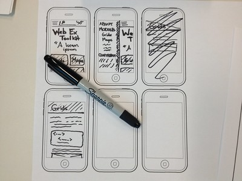

# Midterm Reflections and Generative Writing

**Work to have done**: finish, at least for now, a Visual Argument / Rhetorical Collage and reflect on it

**Plan for the day**:

1. Looking back to look forward (10-15 min)
2. Share and discuss (10-15 min)
3. Web-design unit overview and assignment (10 min)
4. Generative writing toward a proposal (10+ min)
5. Offline sketching (10 min)

## 1. Looking back to look forward

We begin with writing, as a way of priming the pump of conversation, but also, really, as a way of letting your thoughts surface: writing can be a way of telling yourself what you think. It can lead to surprises, if you let it. Try to think on the page.

Below are a series of openings for reflection, focused on (1) surprise; (2) sequence; (3) simile; (4) consumption; and (5) questions. After skimming through, <strong>start with the prompt that speaks the most to you right now, and then move on to others</strong> as you finish answering. Write your response somewhere you'll be able to refer back to it.

<em>NB: Sharing the writing itself will be optional, but I do hope you'll share *some* thoughts aloud today</em>, using your notes to jump off from.

We'll take about 10 minutes here.

<ol class="spaced">
<li>What, if anything, has <strong>surprised</strong> you over the course of the projects so far: the visual argument, the soundscape narrative, or even the collaborative notes on digital affordances?</li>

<li>What do you see as the goals of this assignment <strong>sequence</strong>? For example, what do you see as the relationship among these projects, including the differences between them – or between these and other writing you've done? Would the projects work together in a different order? Would they work in the same way?</li>

<li>See if you can finish one of the following <strong>similes</strong>:<ul><li><em>Writing with {sound, images} is like...</em></li>
<li><em>Writing with {Audacity, GIMP, Photoshop} is like...</em></li>
<li><em>Writing with version control (e.g. git/GitHub/GH Desktop) is like...</em></li>
<li><em>Writing all these reflections is like...</em></li></ul> It's okay to be a little wacky here. Follow your instincts. If you have time, explain the connection.</li>

<li>What changes, if any, have you found in the way you <strong>consume</strong> digital media? Have you found yourself noticing anything new, or differently?</li>

<li>What <strong>questions</strong> are surfacing for you about the course content or assignment sequences?</li>

</ol>

Again, <strong>I won't collect these directly, but I will ask for volunteers to share as part of a discussion in today's class.</strong> That said, you should also keep them to help you develop your pitch for a consolidation/integration project, and as a snapshot of your progress to look back on (and possibly quote) in a final reflection for the end of the course.

EXT 1: If you have a solid metaphor or simile from question 4 above, something that feels true, what might you do in the metaphorical world to continue learning and 'leveling up'? What does that metaphorical advice suggest you might try in the real world? If you don't have one yet, go back and try to write one now.

EXT 2: Reflect on your goals for the course: given your goals and expectations when you began this class, what have you begun to learn? Combined with what you now know about our projects and scheduling patterns, what would you give yourself as a goal for the rest of the term?

<!--

To get credit for asynchronous participation,
<ul>
<li>Set yourself a 10 minute timer and do the writing above. Then – because GitHub's issue queues are not equipped for streaming media, alas – </li>
<li> <strong>Head into <a href="https://canvas.pitt.edu/courses/78948/assignments/527213">Canvas</a> to record a quick Flipgrid video</strong> about one piece of what the writing got you thinking about. <ul><li>Aim for more than 30 seconds, but less than 3 minutes, to simulate what we did in class.</li><li>Feel free to watch the class recording first, so you have the option of responding to what someone said there!</li><li>Any such videos will appear in the <a href="https://canvas.pitt.edu/courses/78948/assignments">Assignments section</a> under "Async video/sound contributions."</li></ul></li>
</ul>

 -->

## 2. Share and discuss reflections + questions (10-15 min)

Any volunteers to share?

Anyone have a different response?

<!-- Again, I'd really like to get everyone's voices in the room today.  -->
I want to make sure we leave plenty of time for generative writing toward the new unit, especially with spring break next week, so I'll have to cut us off by 1:30 or so. (Apologies! If we have time later, we can come back.) Any outstanding insights or questions, especially those you'd prefer remain anonymous, please post to the [shared google doc](https://bit.ly/cdm{{site.course.slugterm}}-notes).

## 3. Web-design unit overview and assignment

As I explained in the syllabus, your third project is to **build a portfolio website using basic html and css files** — as opposed to a site manager like WordPress or Wix — **along with any media assets you wish to embed.** In assigning this, I have two main goals for you:

1. to learn how to manage a composite project made up of multiple interlinking files, and
2. to explore the affordances of the web design stack as a medium, and especially its ability to _flexibly render content for multiple audiences or reading priorities_.

  To read the full assignment – and fork a copy for yourself – go to <strong><a href="https://github.com/benmiller314/webs{{site.course.slugterm}}#project-3-website-portfolio">github.com/benmiller314/webs{{site.course.slugterm}}</a></strong>.

Let's read through this together.

## 4. Generative writing toward a proposal (10-15 min)

Take a few minutes to think in writing about the websites you might want to make. I'll read a series of questions aloud. Repeat them silently to yourself, and when you feel yourself answering, make a list.

These lists will remain private, unless you choose to share. I won't ask for them.

1. What have you been working on, in or out of this class, that you'd like to show the world? What have you made, or done, or pursued?
    - Or: if you'd rather the site not focus on _you_, what groups, things, or events might you represent?
2. Is there anything else you might add to the list? A wider context for one of the projects already there, or a related next step?
3. Is there anything you're forgetting? Something you were recently talking about, or planning for? Add it to the list.
    - If you haven't yet included your work for this class, be sure to add it now.

Take a moment now to read back over your lists. **How might you _group_ or _divide_ these items? What clusters do they form?** Mark these in some way.

Is there one cluster that stands out, that says, _me, pick me_? Choose one group to work with, at least for today, and name it in some way. Then copy the name into a clean page.

With that chosen subject, write again:

4. What terms or images come to mind when you think of this subject? ... Think about actions... things... descriptors.
5. I'm going to interrupt you now and ask you to set aside the list, just for now, and ask: **What's the heart of this?** What's the essential component for this cluster of things? What ties them together?   See if you can summon up the whole of this idea, like it's right here in the room with you. Where does it live? Is it above you? Inside you? In the palm of your hand? Just sit with your idea for a moment, feeling where you connect to it.

NB: If you're feeling stuck after the loop writing above, you can turn to one of the <a href="https://github.com/benmiller314/webs{{site.course.slugterm}}#parachute-prompts">parachute prompts</a>.

## 5. Offline sketching (10 min)

And now, draw. Given what's essential, given your knowledge of how websites work, and given the principles of designing for attention we learned last unit, <strong>make a few quick sketches of your possible website's landing page.</strong>

<em>Starting with a mobile phone layout</em>, what would you want to make sure visitors to the site will see without having to scroll? Where might they click to go deeper into your site?

Once you have a few options for mobile, consider how you might change the layout given the added space of a laptop screen. What might you add for a full-sized desktop monitor?

Not sure what that should look like? Above all, keep it simple: basic shapes, minimal text; you're aiming for proportions and top-level hierarchy. For more depth, you might want to check out <a href="https://careerfoundry.com/en/blog/ux-design/wireframing-mobile-apps-websites/">this free guide from Career Foundry</a>.

<figure>
  
  <figcaption><a href="https://www.flickr.com/photos/28678196@N04/9491795946">Wireframes</a> by <a href="https://www.flickr.com/photos/28678196@N04/">@resultsjunkie</a> via flickr, <a href="https://creativecommons.org/licenses/by-sa/2.0/" title="Attribution-ShareAlike License">CC-BY-SA-2.0</a></figcaption>
</figure>

* EXT: Will "inner" pages look the same as the landing page? Sketch out the possible differences. Consider the possibility that someone jumps directly to an inner page (e.g. from Google). What would they need to feel oriented? To get to other pages on the site? (What would you suggest they view next? How might you lead them there?)
* EXT: Finished one drawing? Make another, using a different system of visually organizing your information.

# For next time:

* Review sample student website projects:
  - [Fatema Quaid](https://fatemaquaid987.github.io/website/index.html), by Fatema Quaid
  - [Hi, I'm Caela](https://cmgo412.github.io/website-portfolio-2021spring/), by Caela Go
  - [Loose Leaf](https://cap-alt-delete.github.io/website-portfolio-2021spring/), by Lynn Priestley
  - [The Rwandan Genocide: 100 Days of Silence](https://shreyababu.github.io/website-portfolio-2020fall), by Shreya Babu
* Consider the collections of work you might want to gather
* **Write** a website proposal, including at least one hand-drawn design sketch, types of pages, a prospective asset list, and a link to your repo. Post to the <a href="{{site.github.issues_url}}">issue queue</a>.

* EXT: If you haven't yet, spend some time getting to know your plain-text editor.
  - Can it show two or more files side by side? Can it preview how an html file will render? Does it allow plugins or extensions to enable either of those things?
  - If you're using VS Code, you may want to check out the tutorials starting here: [Learn Visual Studio Code in 7 min](https://www.youtube.com/watch?v=B-s71n0dHUk)
    * I also recommend adding an HTML Preview extension; I use the one by George Oliveira
