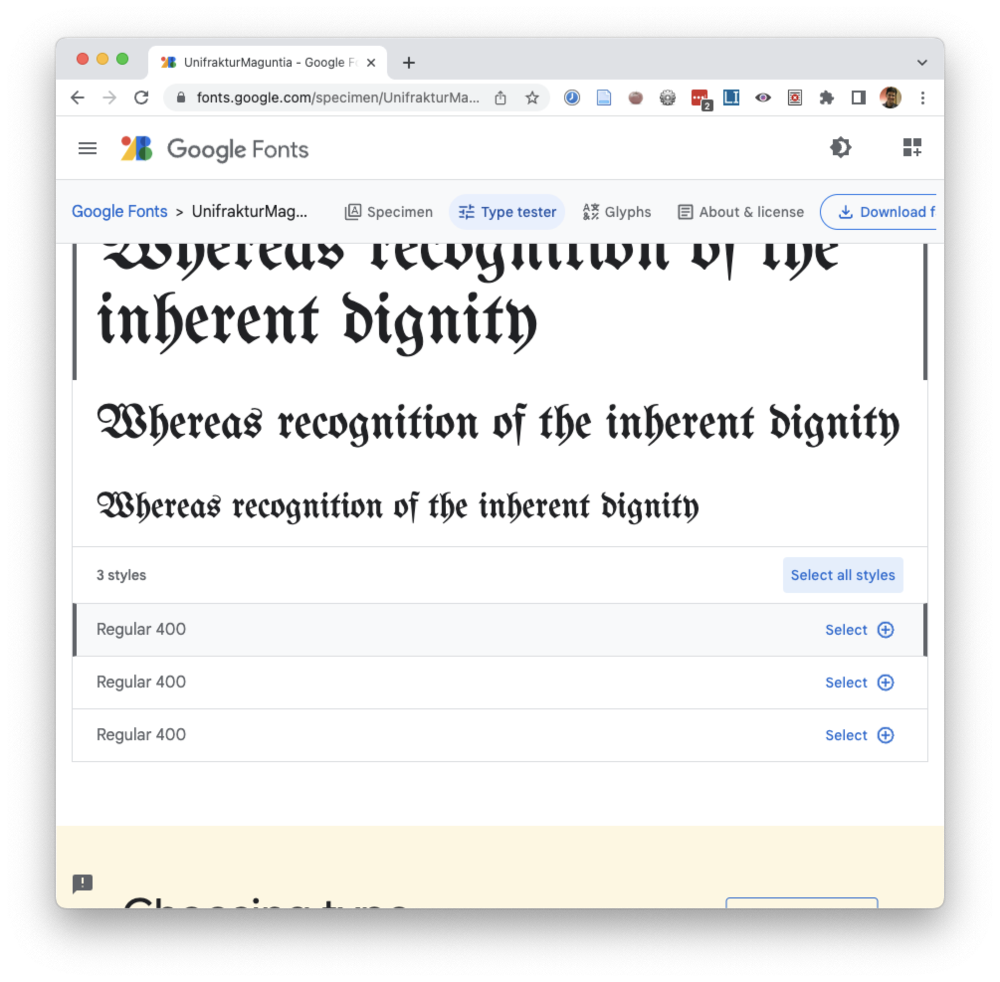
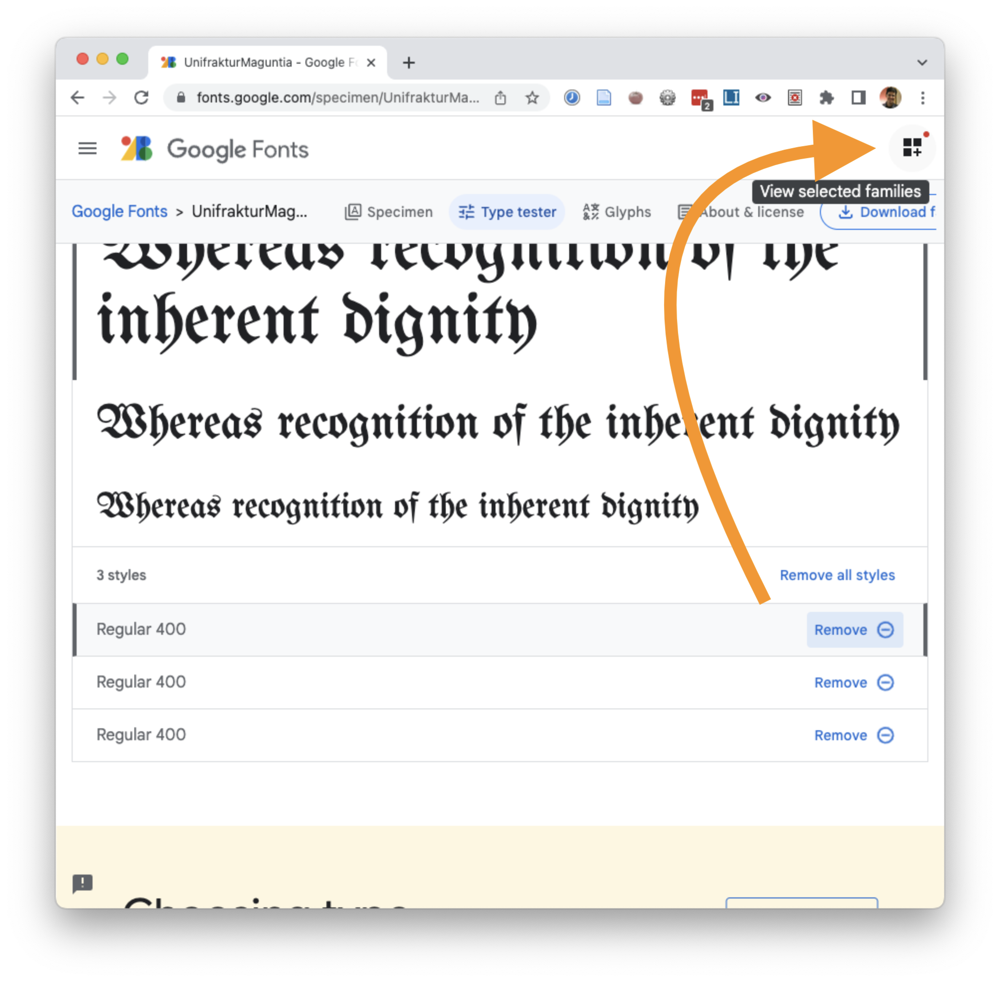
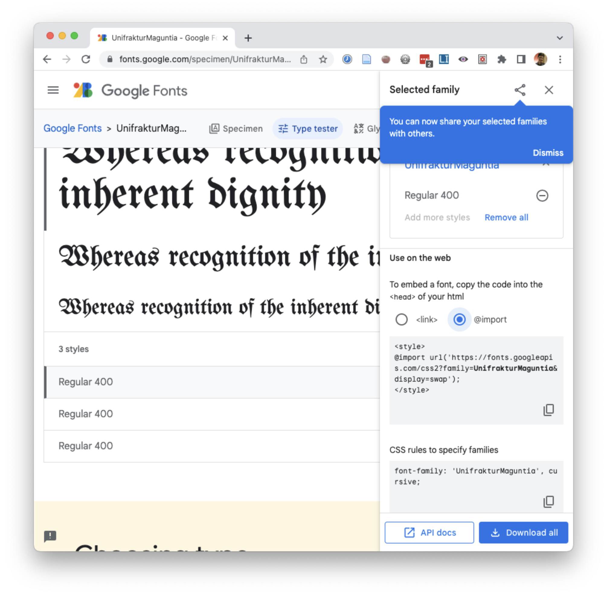

# Web Unit Criteria and Stretch Goals / Studio

**Work to have done** 

* As much of the [Interneting is Hard](https://internetingishard.com/html-and-css/) tutorial as you can, now including Web Typography and Semantic HTML
* A second website preview, now with some kind of layout

**Plan for the day**:

* Google Fonts update

1. Reflective writing on current projects (5 min)
2. Reflective writing on websites you've liked (5 min)
3. Apply reflections to update criteria (20 min)
4. Studio: from structure toward layout
  * Reminder about scoping (and screenshots)
  * Set Goals
  * Go forth!
  * Exit note
5. HW: workshop-ready draft

## 0. Google Fonts update

The tutorial chapter on typography included some out-of-date screenshots of Google Fonts, and Google Fonts does make the import code a little hard to find. Here's an updated version:

  

    <figure id="slide-1">
      
      <figcaption>1. The "select font option" now just says "Select" (or "Select all styles").</figcaption>
    </figure>
    <figure id="slide-2">
      
      <figcaption>2. Selecting any style will activate the "View selected families" button on the top right. (It's a bit subtle.)</figcaption>
    </figure>
    <figure id="slide-3">
      
      <figcaption>3. That button opens a sidebar. Note that <code>@import</code> code can go in your stylesheet instead of your <code>&lt;head&gt;&lt;style&gt;</code>.</figcaption>
    </figure> 
  
 <!-- /.slides -->

  <a href="#slide-1" title="jump to slide 1">1</a>
  <a href="#slide-2" title="jump to slide 2">2</a>
  <a href="#slide-3" title="jump to slide 3">3</a>

 <!-- /.slider -->

## 1. Reflective writing on current projects (5 min)

In your own space – you won't have to share this unless you want to – do a little writing about your website portfolio in progress.

 <ul>
   <li>What's exciting about it?</li>
   <li>What's challenging about it?</li>
   <li>What are you unsure of?</li>
 </ul>

## 2. Reflective writing on websites you've liked (5 min)
Shift now in your writing to think about other people's websites: the websites you navigate every day.

* What seems to make them easy to get through, to find what you need?
* What causes frustration?
* How do you think their _structure_ might be related to their various _audiences_ and their reasons for viewing the site?

Jot down some notes.

EXT: Finished and waiting for others? Start working on two lists:
make two quick lists (just about a minute each):
1. Questions I have about layout (or responsive design)
2. Things I've learned about layout (or responsive design)

## 3. Gathering criteria (20-30 min)
Primed now by that writing and thinking, I'm going to ask you to get in groups and brainstorm in pursuit of baseline and aspirational criteria for this unit.

Remember to *talk to each other about what you value!* 

### 3a. Review, comment, and suggest (10 min)
You're used to this process by now, yes?

Criteria from previous semesters are posted in our [shared google doc](https://bit.ly/cdm{{site.course.slugterm}}-notes#heading=h.r43u6ni5bsc6) as a starting point.

In groups at your tables, take 10ish minutes to talk amongst yourselves about what's working, what's missing, and what you'd like to move or modify.

As you reach consensus in your group, <strong>add comments</strong> or <strong>use the "suggestions" feature</strong> (click the pencil icon in the top right) to propose modifications or additions. Or ask questions, if you have them! If you prefer, you can also just upvote.

Remember that **aspirational criteria are not required, but baseline criteria are**. Given the goals of the unit, what should we set as our minimum criteria for full credit? What are some ways we might push beyond that minimum – not merely in terms of quantity, but in terms of quality or challenge level? _I really want you to see these aspirational goals as opportunities to stretch yourselves and your skills, not just to do more of the same._ Think about what would be new and potentially exciting... but not required for everyone.

EXT: If your group feels finished, skip ahead: read through other groups' notes, respond to their questions on yours, or start discussing thoughts and questions on how to achieve your personal preferred aspirational goals.

### 3b. Comment and Discuss in the Doc (15-20 min)
As you finish up, read through the other groups' notes,  *collegial* replies to their comments in the margins to **upvote**, **ask questions**, or **propose modifications**.

Make sure to loop back to your own comments to see if you've picked up anything to respond to.

ALT: If you're joining us asynchronously, please also leave comments, especially with questions or suggestions. You will be held to these criteria, too, so make your voice heard!

We won't finalize them until after workshop next week.

EXT: If you finish early, move on to the next section.

I'll work solo to write up a clean list that reflects your consensus in the comments, while you all work solo (with groupmates on-hand for questions or other feedback) on your projects and any needed tutorials.

### 3d. Know that you are mutual fonts of knowledge (10 min)
Before you break off into individual projects, share your questions about layout and responsive design (which you may have written down in the EXT above). Use what you've learned to try to answer each others' questions.

Questions your group can't answer? Post them to the google doc, and I'll work on posting answers there.

## 4. Studio: from structure toward design

Keep working on your projects and/or tutorials. I'm hoping by now you're starting to get at least the HTML content of at least one page in place on your preview, and you've just read up on fonts, Grid, and Flexbox, so it's a good time to practice the principles from last class's video!

### Reminder of needful things
I've said all of this before, but it bears repeating:

* Beware of scope creep; plan for phased releases, starting with a minimal deliverable product and adding stretch goals from there.
* Use _relative_ file paths where possible: this will ensure your files work on GitHub, or when a classmate clones your repo from GitHub.
* To the best of your ability, keep the HTML about content (or grouping); keep the display in the CSS.
* Don't forget accessibility: every `img` should have `alt`, and headings (`h1`, `h2`, etc) shouldn't skip levels.
* When you're ready to work on appearances, you can [play with CSS rules using the browser's Inspector](https://pitt.hosted.panopto.com/Panopto/Pages/Viewer.aspx?id=befd7ed1-81e0-4f73-a28e-afc7010eb105).

### Other notes and ways to level up

I found a better CSS Grid intro!

If you liked Kevin Powell's video last time, you might like his video called <a href="https://www.youtube.com/watch?v=8QSqwbSztnA">Get started with grid WITHOUT being overwhelmed</a>! It's about 9.5 minutes long... if you play it back at normal speed. It uses a total of about three CSS rules plus a couple of media queries to build a responsive layout with one, two, and four columns depending on size. Highly recommend! Includes follow-up links below the video for those interested.

Take on the lowest line-count challenge.

If you repeat the same CSS rules across multiple selectors, ask yourself: do those need to be separated? Could they be combined into a shared class that you reuse in several places?

If you're using a <code>div</code>, ask yourself: what is this grouping? If there's only one element inside of it, does it need to be there? (Sometimes, yes, for layout – but most of the time, no, despite what the tutorial might suggest.) See my <a href="https://pitt.hosted.panopto.com/Panopto/Pages/Viewer.aspx?id=9171fa85-be27-437d-99b9-acfa00f44a4f">brief screencast updating the Flexbox tutorial</a>.

Take advantage of parent selectors and classes to limit the scope of CSS rules

  
If you're worried a rule will spread too broadly, e.g. affecting inner page <code>&lt;h2&gt;</code>'s when you only meant it to apply on the front page, just limit the scope of the css rule by specifying a class, or a parent container, or both. For example, the following code will only apply to <code>&lt;h2&gt;</code>'s inside a <code>&lt;body class="front"&gt;</code>:
  <pre><code class="css">
  body.front h2 {
    font-size: 18px;
  }
  </code></pre>
  (Setting a class on the <code>&lt;body&gt;</code> is a good way to set up page-wide contexts, e.g. for background or the position of a navigation bar.)
  

  

  Or here's code that only applies to an <code>&lt;h2&gt;</code> when it appears inside an element (a <code>&lt;div&gt;</code>, say, or a <code>&lt;header&gt;</code>) with class "title-block":
  <pre><code class="css">
  .title-block h2 {
    font-size: 18px;
  }
  </code></pre>
  This solution probably makes the most sense if you want to do some styling on the containing element, like changing its background or centering a bunch of things.
  

  

  Or – probably the simplest solution of all – you could just set the class directly on the element, calling it something like "subtitle" (or whatever you want to call it): <pre><code class="html">&lt;h2 class="subtitle"&gt;</code></pre>
  <pre><code class="css">
  h2.subtitle {
    font-size: 18px;
  }
  </code></pre>

  This has the extra advantage that you can set a lot of other rules for <em>all</em> <code>&lt;h2&gt;</code>'s, and just add the tweaks you need for the subtitle in this additional ruleset. In other words: the Cascading Style Sheet will cascade!
  

Do search for tutorials! Just... be mindful of when they're from.

You don't have to reinvent the wheel. Sometimes programming is like plumbing: you can find the pieces you need and just hook them together, turning them around until things flow.

But please be aware that there's still stuff out there from the early web that's now deprecated, for all sorts of good reasons, including accessibility: you should <em>not</em> be using <code>&lt;table&gt;</code> or <code>&lt;frameset&gt;</code> for layout. Grid is more accessible, more powerful, and, frankly, makes more sense!

### Set Goals
In the [shared google doc](http://bit.ly/cdm{{site.course.slugterm}}-notes#heading=h.g74wxdew24hy), **set a goal for today**: what do you need to do to level up on HTML, CSS, and resource gathering to move toward your specific project? Note that we'll have a Web Unit workshop on Tuesday, so I'll ask you to bring in some kind of peer-reviewable draft.

### Go forth! And Don't forget to document your process

Save periodically as you go:
 <ul>
   <li>as a project file</li>
   <li>as a screenshot, showing your process</li>
   <li>as a git commit, saying what you've just achieved</li>
 </ul>

<aside>

NB: If you ever need to go "back in time" on your project, git lets you do so! Follow the steps at <a href="https://dangitgit.com/">dangitgit.com</a> to reset your point in the project history, take a few screenshots (or, for earlier projects, export a flattened .png or .mp3), and then repeat the process <em>without making any new commits</em> to return to the present. It's pretty nifty!

</aside>

### Exit note

Before you leave, just as a way for me to check in, I'd like to hear more about what happened today: Did you decide on your navigation? Block out the html? Make some progress on a stylesheet? Work through a tutorial or two (and which)?

<strong>Reply to your note in the <a href="http://bit.ly/cdm{{site.course.slugterm}}-notes">google doc</a>.</strong>

<!--

As usual, to get credit for asynchronous participation, please add your intentions and exit notes to the google doc when you start and stop working – and aim to work for at least two 20-minute pomodoros. It helps me if you flag this as a suggestion or comment, so I get an email alert, but you can also just send an update email to me directly. : )

 -->

## Homework for next time

Reminder: Accessible CSS workshop tomorrow, March 24, in this room, 2:30-3:30pm!

* Work to push a **full draft to GitHub by 10:00am Eastern Time on Tuesday**: a solid attempt at a complete website, ideally meeting baseline criteria. Rough edges are still welcome.
  - If you're including other people's images or other media assets, don't forget to update your *source credits and permissions* / license to use them. You can include these right on the website, or link from the website to a file (credits.md, or even README.md) in your repo.

* If you're pretty sure by Monday dinnertime that you won't be ready to turn in a draft, please let me know ASAP so that I can responsibly rearrange peer-review groups.
  - That said, remember that pretty much any start, however rough, will count here. Even <a href="http://loremipsum.io">placeholder content</a> with navigation lets us see the parts you're thinking about, and maybe we can help you move forward from there.

To double-check that your partners will see the files as you intended, please <strong>download a .zip from your GitHub.com repository to a second location on your computer</strong>. Does your site open in a browser? Does it look right, or did you forget to push the latest changes?

