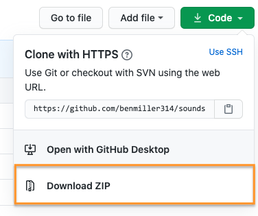

# Web Unit Workshop

**Work to have done**: a solid attempt at a complete website, ideally meeting baseline criteria. Rough edges are still welcome. 

    
Please make sure your files are all committed and pushed to GitHub, and indicate at the top of your README file where to find your landing page! In absence of reasons not to, go with <strong>~/docs/index.html</strong>.

<!-- 
 -->

Relatedly, if you're using Jekyll or React or something like it, please give instructions on how to load your most current rendered website, e.g. a link to the published GitHub Pages site. In that case, partners, you may want to View Source on the final rendered page.

<!-- 
 -->

**Plan for the day**:

1. Update the workshop cycle for our unit (3 times 15-20 min)
  - Describe what you see in the HTML, then in the browser
  - Evaluate using our shared criteria
  - Suggest ways to level up
  - Post comments on the latest commit
2. Identify your partners
3. Work through the cycle (and reflect)
4. EXT homework: forum on consolidation unit

## 1. Update the workshop cycle for this unit

Like the last two times, I'd like you to use a workflow that, first and foremost, *helps you see what's already happening.*  

It takes practice! Please do try: it helps make your comments more concrete and actionable, for both your partner and yourself. It's great to like something, but _if you can't say **what** you liked, the creator can't build on that knowledge as effectively... and **you** may not be learning as much as you could by naming what you value._

**A good test is whether you can tell, just from reading your comment, what you were reacting to.**

<!-- 
Note for async workshop: You may want to time yourself. In class we wouldn't have more than 15-20 minutes for each of three partners.

 -->

### 1a. Describe what you see
Begin by saying back what's there, so your partner knows whether their intentions are being understood. NB: For this unit, in which display is a separate – and often challenging – concern, I'm going to ask you to use a <em>two-step description</em>:

* **First look at the HTML, and say back what you see there.** What seem to be the major content areas? What's given top-level focus? (e.g. what kind of things are getting their own pages, or what's at `<h1>` status within a page?) What's next in the hierarchy?
* Once you've done that, **turn to the browser and repeat the process for the display.** What's given visual weight? What falls "above the fold"? Where are you invited to go next?

### 1b. Evaluate using our shared criteria

Review the [baseline criteria and aspirational goals](http://bit.ly/cdm{{site.course.slugterm}}-notes#heading=h.iizq884or97n) we set last week, which I'll paste below for convenience.

* Is your partner's draft meeting baseline criteria? If not, where not?
* Where is your partner's draft going beyond baseline? Is the draft already meeting any particular aspirations?
* Does the hierarchy of the display correspond to the hierarchy implied by the HTML? If not, describe where they differ.

NB: This is still a form of description, not a judgment of anyone's ability. We're all still learning here!

Baseline

For a minimum grade of B, all projects for this unit must…
<ul><li>Use arrangement, size, color, visual rhythm, and/or contrast to focus viewers' attention.</li>
<li>Include at least 2-3 navigable html locations (multiple pages, or multiple scrolling locations on the same page)</li>
<li>Have a clear mode of navigation among the pages (no dead ends)</li>
<li>Include a sitewide css stylesheet (i.e. an organized visual theme), even if it's over-ridden in some cases</li>
<li>Include at least one legally useable image, with alt text</li>
<li>Credit all assets correctly, including attribution (creator names) where required</li>
<li>Successfully display locally in a web browser</li>
<li>Use meaningful commit messages that say what’s changing (or even why)</li>
<li>(For all of the above, argue in the reflection why you did what you did – or what you would do if you had more time)</li>
</ul>

Aspirational

To target (but not guarantee) a grade above a B, the best projects for this unit may do some (but probably not all!) of the following:

<em>Media Files</em>
<ul><li>Include playable media: <code>&lt;audio&gt;</code>,  <code>&lt;video&gt;</code>, <code>&lt;iframe&gt;</code>)</li>
<li>Use many images, laid out in a clear pattern (e.g. grid, alternating left/right)</li>
<li>Optimize image filetypes, resolutions, and file sizes for faster loading</li>
<li>Make or modify your own multimedia content (e.g. graphics, audio, video)</li>
<li>Have a system to display other sorts of media files from the browser (docs, pdfs, etc)</li></ul>

<em>Dynamism</em>
<ul>
    <li>Use responsive design (e.g. <code>@media</code> queries, <code>flex-wrap</code>, <code>auto-fill</code>, etc) to dynamically resize elements based on viewport width</li>
    <li>Animate HTML elements via JavaScript (e.g. image carousel) or CSS (e.g. <code>:hover</code> / <code>:focus</code> events, <a href="https://css-tricks.com/css-only-carousel/">scroll-snap</a>)</li>
    <li>Add interactivity via JavaScript (e.g. on-click events)</li>
    <li>Include a loadable alternate stylesheet / theme (e.g. dark mode, high-contrast) if you can explain why it’s helpful in your reflection (e.g. does it make the site more accessible? Is it a print stylesheet?)</li>
    <li>Include forms, user input, or other interactive elements (via JavaScript or <a href="https://benmiller314.github.io/cdm2023spring/resources#:~:text=looking%20to%20integrate-,form%20submissions,-within%20their%20static">3rd party service</a>)</li>
</ul>

<em>Coding</em>
<ul>
    <li>Use Flexbox or Grid (or Float) layouts</li>
    <li>Use advanced navigation, e.g. drop-down menu, tabs, or sticky nav bar</li>
    <li>Make your HTML semantic where possible (<code>&lt;nav&gt;</code> and <code>&lt;footer&gt;</code> over <code>&lt;div&gt;</code>, include <code>&tl;main&gt;</code> and <code>&lt;section&gt;</code>s</li>
    <li>Condense your CSS stylesheet to the best of your ability</li>
    <li>Use Jekyll (built into GitHub Pages; see <a href="https://benmiller314.github.io/cdm2022spring/resources#:~:text=write%20the%20navigation%20once%2C%20and%20automatically%20have%20it%20pulled%20into%20every%20other%20html%20page%20you%20write">Resources</a> page) to minimize repetition in your HTML through templates and variables</li>
    <li>Use a web framework to build your website (angular, react, etc. but also bootstrap, skeleton, etc, depending on your level)</li>
    <li>Use a JavaScript library (jQuery, etc)</li>
    <li>Use JavaScript at all, if that's new to you</li>
    <li>Add comments, whitespace, and other formatting to code to make it more readable</li>
</ul>

<em>Audience Engagement</em>
<ul>
    <li>Load site publicly over the internet (e.g. with GitHub Pages)</li>
    <li>Use best practices for accessible design (see W3's Four Principles and the WAVE web accessibility evaluation tool)</li>
    <li>Design responsively for mobile devices</li>
    <li>Have a clear, consistent theme for your website’s <em>content</em></li>
    <li>Apply visual unit knowledge about fonts and what tone they convey or how fonts work together</li>
</ul>

<em>Reflection</em> (not due yet!)
<ul>
    <li>Make a clear argument in your reflection as to why you met enough of the aspirational criteria to be stretching the abilities you came in with: e.g. clarify what skills you came in with, and what was new</li>
    <li>Justify the website's structure for its intended purpose / audience</li>
    <li>(For all of the above, argue in the reflection why you did what you did – or what you would do if you had more time)</li>
</ul>

### 1c. Suggest ways to level up

* Is the draft _almost_ meeting any particular aspirational goals? Which would you suggest trying next?
* Any other ways to improve that you can suggest, based on the readings and advice we've discussed in this class?
* If there was a mismatch between the hierarchies in the presentation and the content, which would you suggest changing, given what you think the intention was? (And here's where revision histories may be helpful, if you have time.)

### 1d. Post comments on the latest commit
Finally, make sure you **post** all these comments – in respectful language you'd be comfortable sharing publicly – on the latest commit on the project's GitHub website.

As a reminder, here's how and where to leave comments on GitHub.
 

Just...
    <ol>
        <li>click through to the history of commits (the clock button);</li>
        <li>click on the _commit hash_, the set of random-seeming numbers and letters almost at the end of the top row (i.e., for the most recent commit); and</li>
        <li>scroll to the bottom of the _diff view_ that appears. You'll see a comment box there: <figure role="figure"></figure></li>
    </ol>

## 2. Identify your partners
As usual, you'll want to click through to the next three people in your row, wrapping around when you hit the end.

NB: If one of your partners has not yet posted a draft, ask them about it and try (if you can) to loop back later this week: we're all trying to navigate the semester as best we can.

<!-- group bullets go here -->
* <a href='https://github.com/alcalaaha/webs2023spring'>Alex</a>, <a href='https://github.com/anayoungblut/webs2023spring'>Ana</a>, <a href='https://github.com/andres-trujillo7/webs2022spring'>Ariana</a>, <a href='https://github.com/jordanmarch/webs2023spring'>Jordan</a>, <a href='https://github.com/ChrisTroina/webs2023spring'>Christopher</a>
* <a href='https://github.com/kellenapp/webs2023spring'>Kellen</a>, <a href='https://github.com/eliotann99/webs2023spring'>Elio</a>, <a href='https://github.com/josieharris1/webs2023spring'>Josie</a>, <a href='https://github.com/taylorjenkins/webs2023spring'>Taylor</a>, <a href='https://github.com/MikeBailey412/webs2023spring'>Mike</a> 
* <a href='https://github.com/BenA03/webs2023spring'>Ben A</a>, <a href='https://github.com/juradodiego/webs2023spring'>Diego</a>, <a href='https://github.com/lks50/webs2023spring'>Lauren</a>, <a href='https://github.com/skygel/webs2023spring'>Skylar</a>, <a href='https://github.com/Asher-Goods/webs2023spring'>Asher</a>
* <a href='https://github.com/bst20/webs2023spring'>Betul</a>, <a href='https://github.com/jannawohl/webs2023spring'>Janna</a>, <a href='https://github.com/suchiattota/webs2023spring'>Suchi</a>, <a href='https://github.com/altrnate/webs2023spring'>Jackson</a>, <a href='https://github.com/michaelpacifico/webs2023spring'>Michael</a> 

Go ahead and click through to your partners' repos, and either clone or **download the zip file** by clicking on the green  button. The latter will be a faster download than cloning, with just the latest snapshot. (But if you want to see revision history, the zip means you'd have to do it on the web.)

Show me

<figure role="figure"></figure>

## 3. Work through the cycle (and reflect)
Repeat the steps above for **three partners**. On subsequent loops, note that *after* viewing the project first, you may also want to read and/or refer to the previous comments.

But this is not just a way of ensuring that you get feedback from three partners; **workshop is also a way of training your eyes, and of realizing new possibilities.** As we head into Thursday's studio class, think about what you've seen that _you'd_ like to try. What suggestions would you give yourself, now that you've given suggestions to others?

<!-- 

I said above that even late peer reviews are due ideally by Thursday morning; even if that's not possible, please be sure to have them completed no later than Thursday at 12:45pm, so your partners have them for in-class studio.

 -->

## EXT / Homework: Thinking ahead
* As I did at the same point in the audio and visual units, I'm inviting you to think forward into the final unit, when you'll work to consolidate or build on what you've learned – possibly in partnership with your peers. See <a href="{{site.github.issues_url}}">the issue queue</a> for more details.
* There is no minimum length for this post, but I am interested to see if folks are interested in collaborating on anything...
* I hope everyone is able to be here and complete this workshop by the end of today's class! But if not, to enable your partners to make use of your feedback in the upcoming synchronous studio, <strong>please post your responses to their GitHub repos by Thursday morning if at all possible.</strong> Thank you!

If you haven't received enough feedback by Thursday morning, please let me know!
