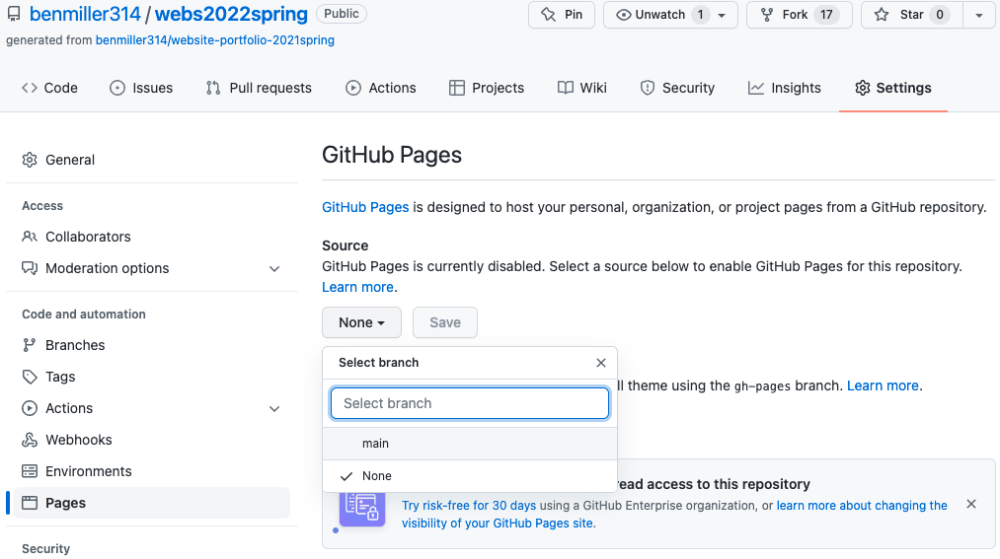
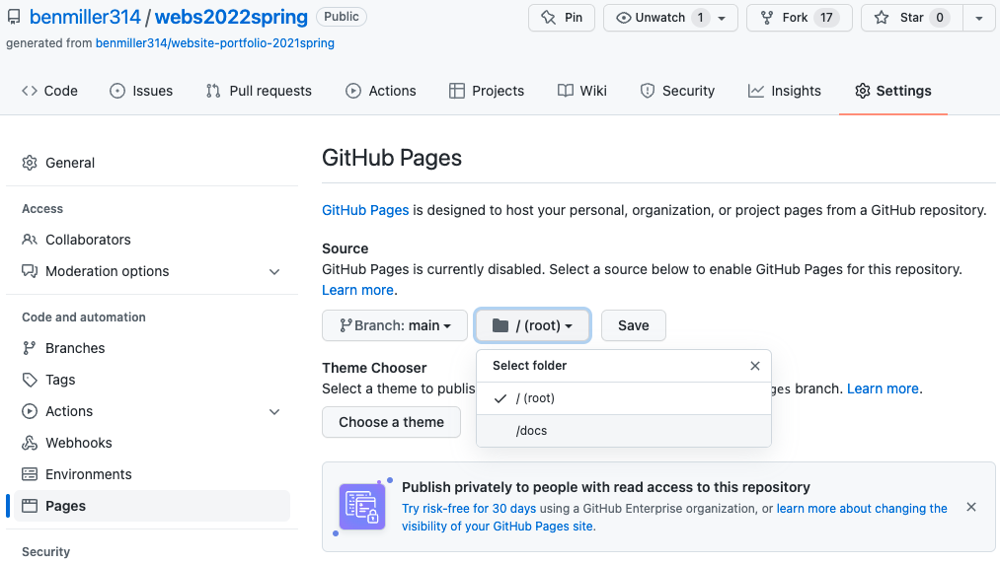

# Final Web Unit Studio / Polishing and Publishing

**Work to have done**: keep building out your web portfolio, working toward baseline and aspirational goals

**Plan for the day**:

* Intro to GitHub Pages
* Thoughts for studio
* Studio time
* Homework: finish your website portfolio and reflection

## Brief intro to GitHub Pages

### What it is
In addition to the wonderful things we've already used GitHub for, like forking, cloud storage, and peer comments on commits, GH also lets you make a fully functional basic website **live and open to the public** – for free. They call it GitHub Pages.

Here's how it works: you store your files in a GitHub repository (in a branch called "gh-pages," like I do for this site, or a subdirectory – look in your own repos!), and GH knows where to find your stuff.

### How to do it

To activate GH Pages,
1. Go to your repository Settings
2. In the sidebar navigation, select "Pages"
3. Change the source from "none" to your preferred branch (probably "main")
4. Change the folder from "/ (root)" to "/docs" (or whichever folder you prefer)
5. Click "save."

And that's it! The settings should now show you the URL where your rendered HTML will appear. If it doesn't, just wait and/or try again; sometimes it takes a minute or two to refresh.

<figure role="figure">
<figcaption>Here’s a visual representation of those instructions.</figcaption>

</figure>

### GH Pages Tips and tricks
The most important caveat: <em>By default, it'll show your README.md file as the home page</em>, unless it finds a file called index.html or index.md.

This is why (as I've said before), rather than call your landing page myproject.html, landing.html, or home.html, you're better off if you **name your homepage _index.html_**. You can always change the <code>&lt;title&gt;</code> to give it a more accurate name in the browser tab. : )

Second, you should be aware that _GH Pages takes a little time to render your latest changes_. For faster feedback on the changes you make, you'll want to **view the _local_ file in your browser**, rather than always waiting for the live site to load.

Third, if you're feeling confident about your code and want to make it less repetitive, GH Pages comes with the Jekyll templating engine built in. Setup for local development with Jekyll is a little more involved (it requires a little command line and Ruby has to be installed), but the documentation is pretty good. You can read more about it, and find a series of relevant links, on our [Resources page](https://benmiller314.github.io/cdm{{site.course.slugterm}}/resources#web-frameworks:~:text=Jekyll%20step%2Dby%2Dstep), at the end of the section on [Web Frameworks](https://benmiller314.github.io/cdm{{site.course.slugterm}}/resources#web-frameworks).

I recommend experimenting with Jekyll in a new branch, though, so you don't lose what you already have. <!-- (If that instruction is confusing, maybe hold off for now; there's always the upcoming consolidation/integration unit for stretching your skills!) -->

### In conclusion

I'm going to recommend that everyone use GitHub Pages to publish your sites unless you have a good reason not to.

And you might! At least one person's using their Pitt domain, for example, and some people may prefer not to take their site live because of copyright or search-result management concerns. But I do want all of you to know that if you want to host a basic website, you don't have to pay a monthly fee for it.

## Thoughts for studio

### Water seeds that still need to grow

[Last class](lesson-22#planting-seeds) included a bunch of advice derived from the developing drafts; if you haven't yet worked through those suggestions, they're still worth checking.

Hopefully everyone has by now received at least 2 (ideally 3) comments from members of your workshop groups! **If you have not, please let me know**, so I can make sure you've got a diverse set of perspectives on your work in progress.

### Finishing touches
Today's new advice is more focused on sites that have essentially come together, and which you now want to refine – or, ideally, take out into the wider world of the web.

Articulate permissions.

If you're using resources you didn't make yourself, be sure to include enough information to recover where it came from: a direct link to the image and to the specific license (if there is one) is ideal. Creative Commons sources often provide that HTML for you!

Where to put this information? Ideally, somewhere small near the image itself. There's a semantic html way of doing this with <code>&lt;figure&gt;</code> and <code>&lt;figcaption&gt;</code>, which you may remember from <a href="https://www.internetingishard.com/html-and-css/semantic-html/#figures-and-captions">the Semantic HTML</a> section of the tutorial; this is what I used for the screencapture images above. (See also <a href="https://www.scottohara.me/blog/2019/01/21/how-do-you-figure.html">this extended discussion of figures, figcaptions, and alt text</a>.)

Alternately, you can have a rights page somewhere, or use the site footer – or have a live hyperlink from your site to an external credits.md file in your repo.

<em>NB: If an image is under copyright, you can still use it if you can make a good case that it's a Fair Use.</em>  See the homework reading after <a href="lesson-04">Lesson 4</a> to review the Four Factors you need to consider.

 <!-- titles -->

Consider titles.

A title can provide a context, a clue, a genre, a commentary; it can add an extra layer to viewer expectations. In previous units, you were titling your entire project; for a website, every page has its own <code>&lt;title&gt;</code> element in the <code>&lt;head&gt;</code>, which will show up in the browser's tab. These titles <em>could</em> be the same for all your pages, but they could also vary. What text do you want on top of the window, to show users where they are?

 <!-- lowest line-count -->

When revising, take the lowest line-count challenge.

Programmers often strive for DRY code: that is, they follow the principle of Don't Repeat Yourself. You can use this as a polishing step after all your content and style is pretty much set – but it may also help you clarify what your HTML is really doing, which can in turn make it easier to style.

Consider the following:

<strong>Do your CSS rules repeat each other? Maybe they can be combined.</strong>

<ul>
  <li>Look for elements that all behave the same way, and give them a shared class. 

show me

  <pre><code class="css">
  /* instead of this... */
  #intro-paragraph {
    width: 80%;
    margin: 0 auto;
    padding: 1em;
    background-color: bisque;
  }
  #about-me {
    width: 80%;
    margin: 0 auto;
    padding: 1em;
    background-color: bisque;
  }
  /* you could do this... */
  p.featured {
    width: 80%;
    margin: 0 auto;
    padding: 1em;
    background-color: bisque;
  }
  </code></pre>

  </li>
  <li>Remember that you can apply more than one class to the same html element – they're just space-delimited – so you can make rules for shared attributes in one class and special cases in another.
  

show me

  <pre><code class="css">
  .narrow {
    width: 80%;
    margin: 0 auto;
    padding: 1em;
  }

  .featured {
    background-color: bisque;
  }

  </code></pre>
  

  </li>
  <li>You can also combine rules declarations for shared styles and override only the exceptions to those styles:
  

show me
<pre><code class="css">
  /* instead of this... */
  h1 {
    font-size: 2em;
    margin-top: 1em;
    margin-bottom: 2em;
    color: maroon;  
  }

  h2 {
    font-size: 1.5em;
    margin-top: 1em;
    margin-bottom: 2em;
    color: maroon;  
  }

  /* you can do this... */
  h1, h2 {
    font-size: 2em;
    margin-top: 1em;
    margin-bottom: 2em;
    color: maroon;  
  }

  h2 {
    font-size: 1.5em;
  }  
  </code></pre>
</li>
</ul>

<strong>Does your HTML have lots of containers with only one element in them?</strong>

<ul>
  <li>Some containers are important for positioning, e.g. centering with a flexbox.</li>
  <li>Others, though, are unnecessary clutter: if you can "unwrap" the element and apply CSS rules directly to it, with no loss in function, go ahead and unwrap it. You can often move classes from an outer element straight onto the inner one. See my <a href="https://pitt.hosted.panopto.com/Panopto/Pages/Viewer.aspx?id=9171fa85-be27-437d-99b9-acfa00f44a4f">demo video from last week</a> for an example.</li>
</ul>

Remember to update your README.

It should have a brief description of the project, rather than just my assignment. And may I also suggest an active link to your live website, if you have one?

## Gathering questions

As in the last class, I've opened a space for anonymous questions in <a href="http://bit.ly/cdm{{site.course.slugterm}}-notes#heading=h.kj9mb0xjbj2z">the google doc</a>.

I'll work through these during in-class down time or office hours, as needed, and I'll let you all know when replies are posted.

<!-- Note to self: don't answer out loud while they're still thinking! Put the answer in writing, *then* let them know it's there. -->

## Studio Time!

### Set an intention
As usual, before you start, <a href="http://bit.ly/cdm{{site.course.slugterm}}-notes#heading=h.d0i4xjvw86kx">go to the next section of the google doc</a> and write a quick line about what you hope to accomplish with your remaining time. e.g. Will you...
  <ul>
    <li>Work on responsive layout?</li>
    <li>Work on replacing placeholder content with real content?</li>
    <li>Work on streamlining your code?</li>
    <li>Work on one of your stretch goals?</li>
    <li>etc etc</li>
  </ul>
Just a sentence or two as a guidepost will give you something to come back to, to reorient, if you find yourself walking in circles or caught in a thicket.

Don't forget to save periodically as you go:
 <ul>
   <li>as an html / css / js file</li>
   <li>as a git commit, saying what you've just achieved</li>
   <li>as a screenshot</li>
 </ul>

### Work Time
Please ask questions as they come up. Otherwise, I'll try to work through the questions from the doc.

EXT: Already done? Head over to the issue queue and read through the <a href="https://github.com/benmiller314/cdm{{site.course.slugterm}}/labels/paying%20forward">"paying forward"</a> proposals for the final unit. Anything you want to collaborate on? (NB: Collaboration is not required for the final unit.)

### Exit Note
Before you leave, just as a way for me to check in, I'd like to hear more about what happened today: did you find images? Level up on a particular CSS skill? Activate your GitHub Pages url? Start drafting a reflection? Raise a question in a new way that you'd like some help with?

# Homework for next time

* Before Thursday's class, **complete – at least for now – your website.** Your repository (on GitHub or in a shared Box folder) should include:
   - A multifile **project folder** (probably called "docs"), containing a combination of html and css files
   - At least two static **<a href="https://www.take-a-screenshot.org/">screenshots</a> (.png or .jpg)** of your web pages or source files in progress.
     * Think about what moments are worth remembering as you go: where did you level up, or realize something, or get stuck?
     * If you need to, you can go back in time using git history!
   - An **updated README.md file**, introducing the Website source code to a new audience. Make the project something to live beyond this assignment, if you can. :¬)
   - Updated credits reflecting what assets you actually used, including documentation of any outside sources and your permission to use them (e.g. explicit licenses like CC, or rationales for claiming fair use)
      * This can be in its own file or as part of your README.
      * If you want, this can (also) be a live page (or a footer) on your website.

* **Also before Thursday's class, and ideally by noon, write a prose reflection** that incorporates images from your feedback and screenshots of your Atom project and the website itself. As explained in the [prompt for the assignment](https://github.com/benmiller314/webs{{site.course.slugterm}}#deadlines-and-products), this should include:
   - At least 500 words
   - Your own assessment of how you met the baseline criteria and goals for the unit, as well as any aspirational criteria as appropriate
   - At least one photograph of feedback you used to revise (and please say how)
   - At least one or two screenshots of your work in progress (ideally, related to the discussion in the previous two bullets)
* **Post your reflection** to the course site's [Issue queue]({{site.github.issues_url}}), to make it easier to embed images.
   - If you want to then copy the source code into a file in your repo called reflections.md, I won't stop you!
   - If you feel strongly that you'd rather keep your reflection private, you can email it to me instead. But my default assumption is that we learn from each other as much as from ourselves, so I hope you can find a way to write publicly about your experience with this project.
* If you need more time, let me know, but also be aware that it's entirely possible to use the Consolidation/Integration unit as an opportunity to keep working, e.g. to take your site from baseline closer to your aspirations.
